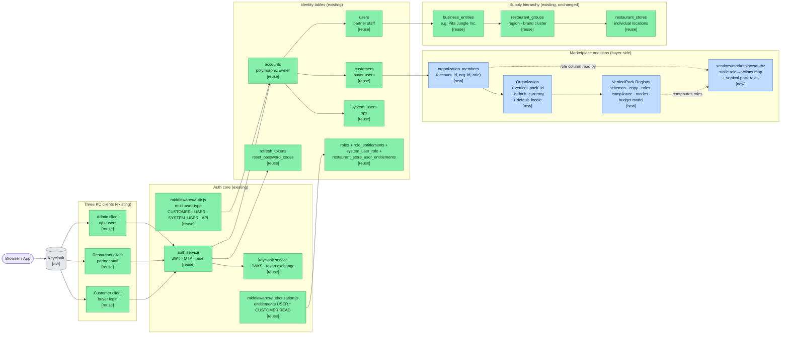
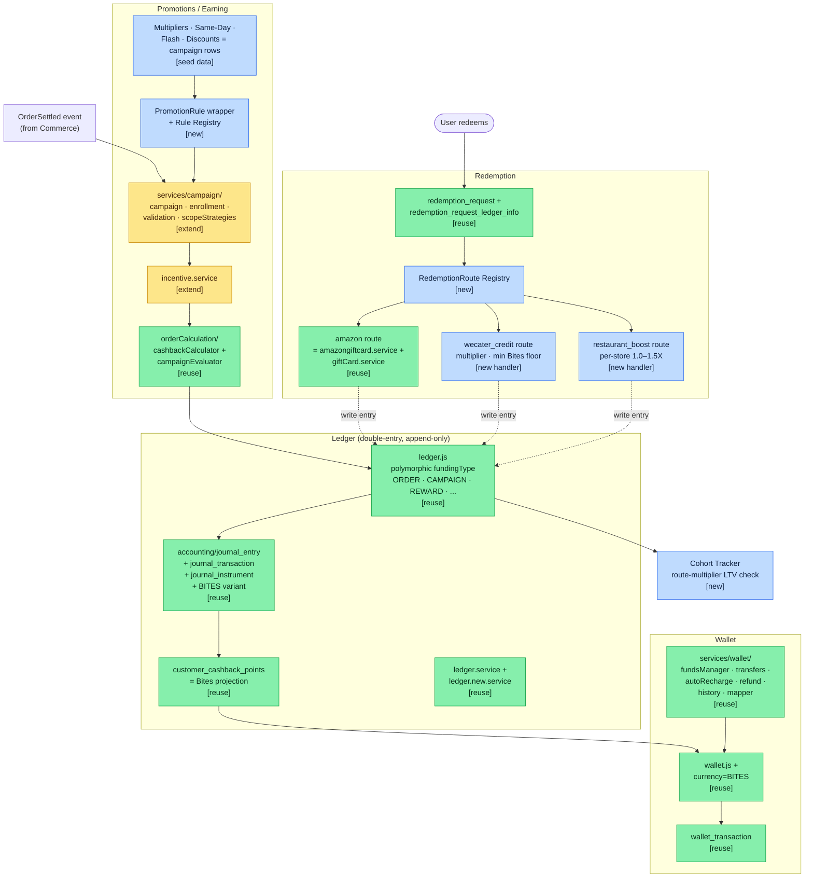
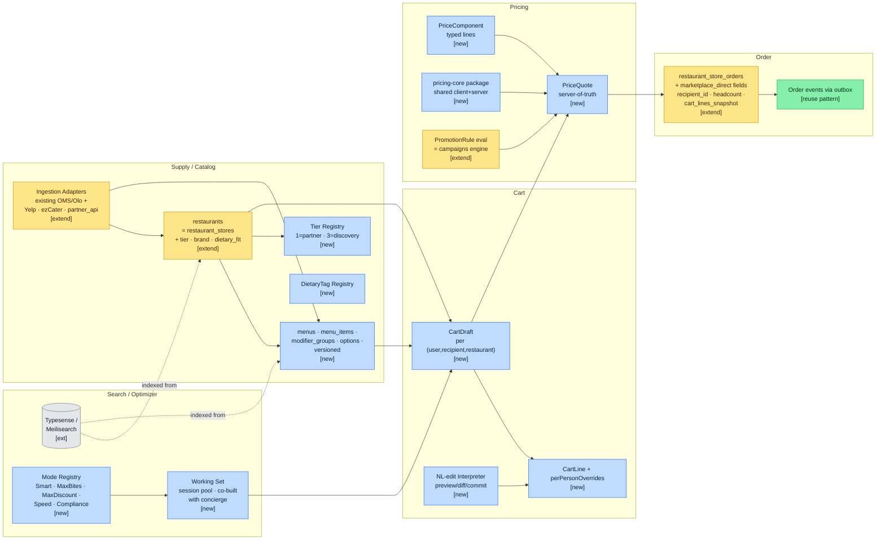
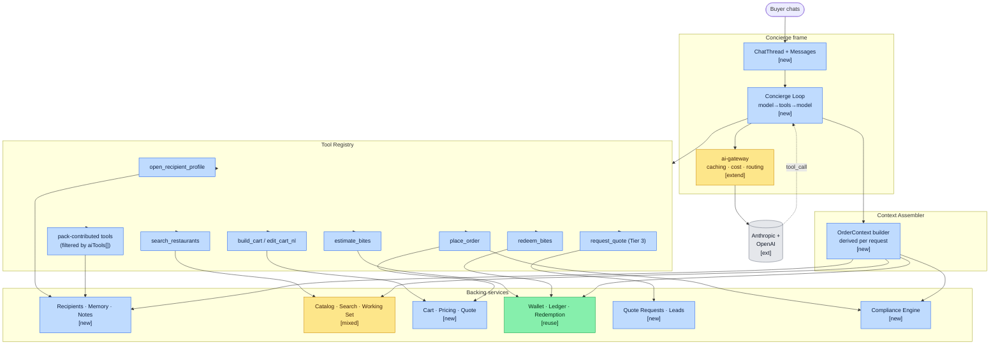
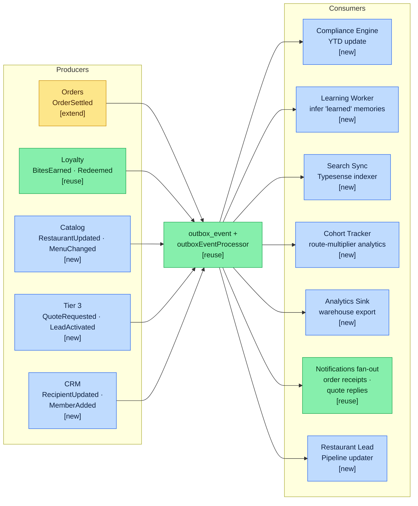

# WeCater — Marketplace Architecture (LLD → HLD)

## Context

This document is the production design of the WeCater marketplace. Constraints:

- **Two services from day one**: the existing backend (`projects/catering-rewards-app/backend/` — ledger, wallet, redemption, campaigns, identity, notifications) and a new **marketplace service** (`projects/marketplace/` — catalog, cart, recipients, memory, concierge, optimizer, quotes, compliance, BFF). They run on different machines and communicate over HTTP + an event bus. Each has its own database; **no cross-service DB access, no shared Sequelize models, no in-process calls between the two**.
- **Single-brand, multi-org tenancy**: one WeCater app, many buyer organizations inside it.
- **Restaurant portal + payouts** from v1 (Tier 1 self-serve; Tier 3 stays operator-mediated).
- **Open to any workforce** that orders catering — corporate EAs, legal firms, hospitals, government, fundraising, nonprofits, pharma reps, schools, conferences, and so on. No vertical is privileged in the architecture.
- **First-class extensibility on four axes**: vertical/persona, compliance framework, pricing/promotion rules, catalog ingestion sources.

Goal of this plan: enumerate the LEGO bricks (LLD), aggregate them into modules and services (HLD), and define the registry-driven extension points so per-vertical specifics (compliance rulesets, promotion configurations, ingestion sources, pack-contributed AI tools) are **configuration, not code branches**. Every vertical plugs in through the same registry contract (§3.1).

**Foundation: extend, don't rewrite.** A mature backend already exists at `catering-rewards-app/backend/` (Node.js + Express 5 + Sequelize/MySQL, ~50 controllers, ~80 models, ~70 services). It has been running in dev/staging/preprod and ships a substantial slice of what the marketplace needs:

- A real double-entry ledger with polymorphic funding types (`ORDER`, `CAMPAIGN`, `REWARD`, `ADDITIONAL`, …).
- A wallet + transaction stack with funds manager, transfers, refund flows, and history.
- A redemption pipeline including Amazon gift cards.
- A campaigns engine with enrollment, scope strategies, and validation.
- Multi-client Keycloak SSO (Admin / Restaurant / Customer) plus a JWT/OTP auth path with entitlement-based authorization.
- An outbox-pattern event service.
- A notifications module with adapters/channels/dispatcher/preferences.
- Stripe billing, S3, SQS, Textract, SendGrid, MSG91 already wired.
- Zod and OpenAI already in dependencies.

The marketplace plan therefore reads as **"a new marketplace service that consumes the existing backend over HTTP for loyalty/identity/notifications/billing, plus a Next.js BFF and a buyer/partner/admin frontend monorepo"**, not "build from zero" and not "extend inside the existing backend." Net-new work concentrates on the marketplace-specific concerns: catalog/menus/cart, recipient CRM with told-vs-learned memory, AI concierge, optimizer/working-set, Tier 3 quote/lead funnel, compliance engine, and the four extension registries — all of which live in the new marketplace service. The existing backend is *consumed*, not *extended in-place*: where the plan tags an entity `[reuse: …]` it means "the marketplace service calls a backend HTTP endpoint that wraps the named existing model/service," **not** "marketplace code imports backend code."

Part 7 below is the explicit reuse map — every module in Part 2 is tagged as **reuse / extend / new** against the existing backend.

This document is design-only. No code is written from it directly; it informs subsequent implementation tickets.

---

## Part 1 — LLD: Domain Primitives

The irreducible entities. Each has its own row(s), lifecycle, and small set of operations. The aggregation into modules (Part 2) is what may shift over time; the primitives are the stable substrate.

### 1.1 Identity & Org

Each entity carries a reuse tag: `[reuse: existing-model]`, `[extend: existing-model + new-bits]`, or `[new]`. Cross-reference Part 7 for fuller treatment.

> Several primitives below reference **VerticalPack** — the registry that lets the same code serve any catering domain (pharma, law firm, hospital, fundraising, …) by switching config rather than branching code. If unfamiliar, **read §3.1 first** for the full explanation; this section assumes the concept.

- **Account** `[reuse: accounts.js]` — login identity. Email/phone, password hash, MFA, SSO link. One per human. Existing `accounts.js` already supports polymorphic owner types (`CUSTOMER`/`RESTAURANT`/`SAASADMIN`).
- **User** `[reuse: customers.js / users.js / system_users.js]` — profile attached to an Account. Display name, avatar, locale, prefs. Buyer-side users live in `customers.js`; partner staff in `users.js`; ops in `system_users.js`. Many-per-Account possible later (a buyer who works for two employers, or a contractor on multiple client orgs).
- **Organization** `[new]` — buyer-side organization (e.g. "Pfizer Field Sales", "Acme Marketing", "Wilson & Carr LLP"). The unit that *places orders*. Has `vertical_pack_id` (pinned to one VerticalPack — see §3.1), `default_currency`, `default_locale`, billing identity, brand metadata. Net-new — no equivalent today. **Not** to be confused with `business_entities.js`, which is the supply-side hierarchy parent for `restaurant_stores` (Pita Jungle Inc. owning multiple Pita Jungle locations). The two namespaces are deliberately separate: Organization (buyer side) and BusinessEntity (supply side) never share a row.
- **OrganizationMember** `[new]` — User ↔ Organization with role. Carries `(account_id, organization_id, role, status, joined_at)`. The `role` is a single column directly on the row in v1 — values from a static set (`owner`, `admin`, `buyer`, `viewer`) plus vertical-pack-contributed values (e.g. a pack with a compliance review step contributes `compliance_reviewer`; a pack with matter-based billing contributes `matter_lead`; see §3.1 for how packs contribute roles). Per §6.9, marketplace RBAC is its own lightweight module (`services/marketplace/authz/`) — it does **not** reuse the existing backend's `roles.js` / `role_entitlements.js` (those continue to serve partner/ops only). No separate `role_assignment` table in v1.
- **VerticalPack** `[new]` — config bundle describing a domain (pharma rep, EA, law firm, hospital, …). One pack per domain, shared across every Organization in that domain. Carries the domain's universal facts: recipient/member shape, copy labels, compliance rulesets, optimizer modes, AI tools, default roles, budget model. **Read §3.1 first if VerticalPack is new to you** — every other entity in this section that says "vertical-pack-something" depends on understanding it.

> **No buyer-side Team primitive.** Catering orders are bulk-for-a-group by definition: one OrganizationMember places an order *for* a Recipient (Dr. Patel's office, the Marketing Team's Tuesday lunch, the donor reception). The "team-being-fed" is the Recipient (§1.2), not a buyer-side grouping. Multiple OrganizationMembers in the same Organization order independently; they don't need a Team membership to do so. If a real budget-pool need shows up later, the cleanest answer is either multiple Organizations (separate billing) or a future budget-group concept — not retrofitting a Team primitive now.

### 1.2 CRM & Memory

- **Recipient** `[new]` — polymorphic "who is this catering order for". Every catering order is bulk-for-a-group, and the Recipient *is* that group. The shape varies by vertical: corporate teams (EA), law-firm client meetings, medical offices (pharma), donor groups (fundraising), conference attendees (events), classrooms (education), patient-care floors (hospital), and so on — none of these is privileged; each is a `recipientSchema` plugged in through a VerticalPack. One OrganizationMember (the buyer) places orders for many Recipients over time. The existing `customers.js` is the *buyer* — Recipient is a separate concept and doesn't exist today. Discriminator: the parent Organization's `vertical_pack_id`. Concrete shapes registered per pack via `recipientSchema` (see §3.1). Carries `organization_id` (tenancy) and `owner_account_id` (the buyer whose "book" this Recipient belongs to — see ownership note below); both columns are non-null. A composite FK `(organization_id, owner_account_id) → organization_members(organization_id, account_id)` enforces "owner must be a member of this org" at the DB level. Optional `created_by_account_id` is a separate audit fact (often equal to owner, but an admin can create a Recipient and assign it to a rep — owner ≠ creator in that case).

> **Why `owner_account_id`, not `owner_organization_member_id`.** Both carry the same identifying information (the recipient's own `organization_id` already disambiguates which membership the ownership is exercised through), but `account_id` survives **membership churn**: if a buyer is suspended and re-added, their Recipients reattach automatically; with an org-member FK they'd orphan. `account_id` also matches every other "who" column in the codebase (`created_by_account_id`, `actor_account_id`, `placed_by_account_id`, …) — see §6.9.6 for the cross-module convention. The composite FK gives the same "must be a member" guarantee the org-member FK would, without the durability hit.

> **Per-recipient visibility is vertical-driven.** Roles on `organization_members` are org-wide (`owner | admin | buyer | viewer` + pack-contributed). They alone do **not** answer "can buyer B see buyer A's Recipients?" — which matters whenever the vertical has personal "books" (territories, donor portfolios, account assignments) and does **not** matter in shared-list verticals (most EA teams, small-firm hospitality). Each VerticalPack therefore declares a `recipientVisibility` mode that the `recipients` service reads on every list/get:
> - `owner_only` — a `buyer` sees only their own Recipients; `admin`/`owner` sees all. Right for any vertical with personal books.
> - `org_wide` — every member sees every Recipient in the org. Right for shared-list verticals.
> - `assignment_table` — visibility driven by a per-vertical assignment table that the pack contributes (e.g. `matter_assignments` for law, `account_assignments` for enterprise sales); falls back to `owner_only` when the assignment table is empty.
>
> The mode is exposed through the VerticalPack registry as `recipientVisibility: 'owner_only' | 'org_wide' | 'assignment_table'` (see §3.1). The `recipients` service composes the WHERE clause from `(organization_id, role, owner_account_id, visibility_mode)`; **no per-vertical branching in the service**.
- **Memory** `[new]` — atomic memory unit: `(subject_type, subject_id, subject_label, predicate, object, source: 'told'|'learned', confidence, learned_at, ttl?)`. Examples: `(recipient, <team-id>, null, prefers_pickup, true, learned, 0.7)`, `(individual, null, "<name>", dietary, "vegan", told, 1.0)`, `(individual, null, "<name>", dietary, "gluten-free", told, 1.0)`. **`subject_label` is the only place individual eaters get represented** — as a free-form name on a memory entry, not as a structured row. The set of valid `predicate` values is gated by the active VerticalPack's `memoryPredicates[]` (see §3.1) — each pack admits the predicates that make sense in its domain (e.g. a law pack admits `matter_code`; a pharma pack admits `competitor_activity`; a plain EA pack admits neither). The closest existing analogue is `customer_tags.js` / `tags.js` (flat tags) but Memory needs the structured told/learned discriminator + confidence — net-new.
- **Note** `[new]` — free-form text attached to a Recipient (or carrying a free-form name in the body); `pinned`, `priority`, `author`, `created_at`. Used for buyer-authored reminders ("call before placing the order", "ask about new dietary asks", etc.).

> **No RecipientMember primitive.** Catering is bulk ordering — we don't need structured per-eater rows. Names appear in two informal places: (1) `Memory.subject_label` (e.g. "<name> is vegan"), and (2) `CartLine.perPersonOverrides[].individual` (e.g. "<name> — allergen removed"). Both are free-form strings. The one case that *does* need structure is **regulatory attribution** — verticals that legally must attribute spend to a named individual (a physician under CMS Open Payments, a client attendee under an ABA meal cap, a donor under a tax-deductibility cap, etc.). That structure is modeled as `ComplianceSubject` (§1.8), which lives in the compliance module — not as a member of the Recipient. Non-compliance verticals have no per-individual structured rows at all.
- **DietaryRestriction** `[new]` — derived projection of Memory entries with `predicate ∈ dietary_predicates`. Cached for fast cart/optimizer reads.

### 1.3 Supply / Catalog

- **Restaurant** `[extend: restaurant_stores.js]` — supply-side entity (one location). Existing `restaurant_stores.js` covers identity, contact, geo, configuration, billing, approval, and integration metadata. Add: `tier_id` (FK to tier registry), `brand_color`, `brand_color_accent`, `brand_hero_url`, `dietary_fit`, `compliance_fit`, `discovery_reason`, `quote_response_hours`.
- **RestaurantGroup** `[reuse: restaurant_groups.js]` — multi-location grouping (e.g. "Pita Jungle — Phoenix region"). Reused as-is.
- **RestaurantBusinessEntity** `[reuse: business_entities.js + business_entity_users.js + business_entity_platform_plans.js]` — top-level supply-side parent ("Pita Jungle Inc."). Owns RestaurantGroups, owns billing relationship with WeCater, employs partner staff. **Distinct from Organization in §1.1.** Reused as-is.
- **Tier** `[new]` — registry-driven tag (`1=partner`, `3=discovery`; space for `2=preferred`, `0=internal-test`). Each tier defines its capabilities (orderable, has menu, payouts enabled, supply-pipeline behavior).
- **Menu / MenuItem / ModifierGroup / ModifierOption** `[new]` — Tier 1 only. Items have `dietaryFlags` + `servingSize`. Versioned (today's price ≠ yesterday's price; old orders reference the old version). No equivalents in the existing schema.
- **EstimatedCart / EstimatedItem** `[new]` — Tier 3 fallback when no real menu exists (price ranges, free-text descriptions). Generated by ingestion, edited by ops.
- **IngestionSource** `[extend: integrations.js + integrations_metadata.js + api_fetch_logs.js + scraping_logs.js]` — adapter identity + ingestion record. The existing OMS/integrations stack (`oms_systems.js`, `oms_systems_restaurant_stores.js`, plus `services/integrations/` adapters for Olo / monkeyMedia / manual / apiFetch) is the right foundation. Wrap behind a unified `IngestionAdapter` interface and add Yelp + ezCater scrapers as additional adapters.
- **DietaryTag** `[new]` — small registry; deterministic mapping vegan/vegetarian/halal/GF/etc. Existing `tags.js` is marketing-flavored, not a fit.

### 1.4 Cart & Order

- **MealOccasion** `[new]` — parent that groups parallel CartDrafts for a single meal/event (e.g. "Tuesday lunch for Marketing", "Henderson deposition Friday"). Carries `(recipient_id, target_date, label, status: active|ordered|abandoned, ordered_order_id?)`. One occasion → many CartDrafts (one per restaurant being compared). Placing an Order against one draft flips the occasion to `ordered`, sets `ordered_order_id`, and cascade-archives sibling drafts in the same transaction. Without this parent, parallel-compare drafts have no shared key for cleanup — `recipient_id` alone is too broad (the same Recipient may have other in-flight occasions). Also the natural anchor for ChatThread (§1.9) — gives the concierge a stable "this planning session" handle that survives across draft/order state.
- **CartDraft** `[new]` — buyer's work-in-progress; one per `(meal_occasion, restaurant)`. Multiple drafts coexist under one MealOccasion to power the multi-restaurant compare flow. No equivalent today.
- **CartLine** `[new]` — `(itemId, qty, basePrice, modifiers, appliesTo, perPersonOverrides[])`. Per-person overrides have shape `{individual, removed[], added[], reason}` and let one line cover most of a group while encoding deltas for individual eaters (e.g. one person's allergens removed).
- **PriceQuote** `[new]` — server-computed snapshot for a CartDraft: `subtotal`, `tax`, `delivery_fee`, `service_fee`, `est_bites_earn`, `applied_promotions[]`, `compliance_impact[]`. Always re-computed server-side; never trust the client. Distinct from §1.7 `QuoteRequest` (Tier 3 supply quote).
- **Order** `[extend: restaurant_store_orders.js]` — submitted CartDraft. The existing model is receipt-cashback flavored (POS / external-marketplace ingestion). Extend with marketplace-direct fields (`recipient_id`, `delivery_address_snapshot`, `headcount`, `cart_lines_snapshot`, `price_quote_id`) or add a `source='wecater_direct'` discriminator. State machine: `placed → accepted → in_kitchen → out_for_delivery → delivered → settled`. Plus terminal states `cancelled`, `refunded`. The existing `non_signedup_user_orders.js` and `market_place_orders.js` patterns coexist for non-marketplace order paths.
- **OrderEvent** `[reuse-pattern: outbox_event.js]` — append-only event log per Order (state transitions, partial-cancel, substitution). Source for analytics. Use the existing outbox event pipeline rather than introducing a parallel table.

> **Update lifecycle.** CartDraft + CartLine are mutable rows updated in place on every edit. PriceQuote is **immutable** — never updated, only superseded by a new snapshot. Don't fire a server-side PriceQuote on every keystroke: debounce ~300–500ms after the user stops editing, OR re-quote at well-defined surfaces (checkout open, "Show pricing breakdown" click, "Place order"). The client-side preview (via shared `packages/pricing-core`, see §6.3) keeps the UI responsive between server quotes; the server quote is what gets persisted and what compliance/promotions stamp into. The submit-time quote is the only one that becomes durable beyond the draft's TTL — pinned via `Order.price_quote_id`.

### 1.5 Pricing & Promotions

- **PromotionRule** `[extend: campaign.js + campaign_details.js + incentive_programs.js]` — pluggable definition: `(id, when, effect, stacking, cap, scope)`. Wrap the existing campaigns engine (`services/campaign/`, `incentive.service.js`) under this abstraction. Multipliers, time-windowed bonuses, fixed grants, and percent discounts all express as campaign rows with `effect_type`, `stacking_mode`, `cap_unit`, `presentation_*` fields. Existing `campaign_customers.js` + `campaign_enrollment.js` give us scoping for free.
- **PriceComponent** `[new]` — typed line in a PriceQuote (`subtotal`, `discount`, `delivery`, `tax`, `tip`, `bites_earn:base`, `bites_earn:welcome_bonus`, `bites_earn:same_day_bonus`, …). Stable schema even as new promotion rules add new components.
- **Currency** `[extend: implicit in money fields]` — make explicit even though USD-only today; multi-currency is a non-trivial retrofit. Affects wallet, ledger, invoices.

### 1.6 Loyalty (Bites)

> **§1.6 is reuse, not rebuild.** The complete loyalty stack — double-entry ledger, wallet, redemption — already exists in the existing backend service (`projects/catering-rewards-app/backend/`). The marketplace service adds **a currency variant** (`BITES`) plus two thin additions inside the marketplace service (new redemption-route handlers and a Cohort tag for analytics). Marketplace code reaches the loyalty stack **over HTTP** via a small internal API the existing backend exposes (per §4.3). No shared Sequelize models, no shared DB; the schema additions below (`BITES` instrument, `currency='BITES'` wallet, `journal_entry_id`-keyed projection) all happen *inside the existing backend's MySQL* and are surfaced through that backend's HTTP API.

**Layering.** Two layers, both pre-existing:

1. **Ledger** (double-entry, append-only, source of truth): `ledger.js` + `accounting/journal_entry.js` + `accounting/journal_transaction.js` + `accounting/journal_instrument.js`.
2. **Wallet projections** (per-user balances and lots — derived from the ledger): `wallet/wallet.js` + `wallet/wallet_transaction.js` (USD-flavored) and `customer_cashback_points.js` (points-flavored, every row carries an FK `journal_entry_id` to its underlying ledger entry).

**Reused — additive enum/column changes only**

- **BitesLedgerEntry** `[reuse: ledger.js + accounting/journal_entry.js + accounting/journal_transaction.js + accounting/journal_instrument.js]` — append-only source of truth. Bites lifecycle (`earn_pending`, `earn_available`, `redeem_reserve`, `redeem_settled`, `adjust`, `expire`) already maps onto the existing `fundingType` enum (`ORDER`/`NSU`/`ADDITIONAL`/`CAMPAIGN`/`REWARD`/`PLAN_F`/`PLAN_V`) plus the journal-instrument abstraction. Pending → available is already first-class. **Additive change**: add `BITES` to the journal-instrument enum — a Bites earn = journal entry with `fundingType='ORDER'` + instrument tagged `BITES`. Nothing above this layer is canonical; every projection derives from it.
- **Wallet** `[reuse: wallet/wallet.js + wallet/wallet_transaction.js]` — derived balances on top of the ledger. **Additive change**: `currency='BITES'` discriminator alongside the existing USD-denominated wallets. `services/wallet/` (funds manager, transfers, refunds, history, transaction mapper, strategy resolver) ports over unchanged.
- **RedemptionRequest** `[reuse: redemption_request.js + redemption_request_ledger_info.js]` — user-initiated. State `created → reserved → fulfilled → settled` (or `failed`) already wired; ledger-entry linkage already wired via `redemption_request_ledger_info`. No changes needed.
- **Wallet-of-Points projection** `[reuse: customer_cashback_points.js]` — existing per-customer points-lot read model: `status` (`ACTIVE | PENDING_APPROVAL | REDEEMED | EXPIRED`), per-lot `expires_at` / `redeemed_at`, FK `journal_entry_id` to the underlying ledger entry. **This is not the ledger** — it is a denormalized read model *on top of* journal entries, and the existing precedent for how a "Wallet-of-Bites" view sits above the ledger layer.

**Net-new — small, code-level only**

- **RedemptionRoute** `[new]` — code-level pluggable registry: `(id, multiplier_fn, min_bites, fulfill_handler, eligibility_fn)`. **Not a database concern** — a function-dispatch table that picks the right handler per route. v1 routes: `amazon` (handler **already built** in `services/amazongiftcard.service.js` + `services/giftCard.service.js` — registry just wires it in), `wecater_credit` (new handler), `restaurant_boost` (new handler).
- **Cohort** `[new]` — thin tag table for analytics cohorts (e.g. validating LTV impact of redemption-route multipliers). Joined to ledger queries on read; no schema change to the ledger itself.

**How marketplace code talks to this stack.** Per §4.3, **HTTP/JSON service-to-service calls** — marketplace and the existing backend run as separate services on separate hosts. The existing backend exposes a small `internal/loyalty/*` API surface that wraps the existing services:

```
POST   /internal/loyalty/wallet/balance       → wraps services/wallet/wallet.service.js
POST   /internal/loyalty/ledger/entries       → wraps services/ledger.service.js
POST   /internal/loyalty/redemption/requests  → wraps services/redemptionRequest.service.js
GET    /internal/loyalty/redemption/routes    → catalog of registered routes
```

Auth is service-to-service (mTLS or signed internal JWT — see §6.9). All write endpoints accept an `Idempotency-Key` because retries cross the network. Cross-service writes that must be eventually atomic (e.g., "submit Order → mint Bites earn") use **outbox events**: marketplace persists the Order and an `OrderSubmitted` event in one local transaction, then the existing backend consumes the event and writes the corresponding ledger entry — no two-phase commit, idempotent consumer. Marketplace **never** imports backend Sequelize models or queries the backend's MySQL directly.

### 1.7 Tier 3 / Supply Recruitment

- **QuoteRequest** `[new]` — buyer asks Tier 3 for a quote. Owns its PDF artifact (rendered server-side; never client-side), recipient details, dietary asks, budget, expected response window. PDF blob lives via existing `s3.service.js` + `file_upload.js`.
- **QuoteReply** `[new]` — restaurant-side response (parsed from email or entered by ops). Optional menu attachment, pricing, lead-time.
- **RestaurantLead** `[new]` — Tier 3 in activation pipeline. State: `discovered → contacted → engaged → quote_received → activating → activated → tier1` (or `lost`). Each QuoteRequest contributes to the lead's signal score. Distinct from existing `invite_requests.js` (which invites users to *existing* restaurants); leads represent *prospect* restaurants.
- **OutreachMessage** `[reuse: notification.js + notification_logs.js + sendgrid.service.js + sms.service.js]` — outbound email/SMS via existing notifications stack with new templates for restaurant outreach. Inbound reply parsing is net-new (see §1.10 InboundMail).

### 1.8 Compliance

- **ComplianceRuleset** `[new]` — pluggable per vertical: `(id, subject_type, key_attrs[], thresholds[], hooks)`. Attached to an Organization indirectly via the active VerticalPack's `compliance[]` field (see §3.1). The marketplace ships zero rulesets out of the box — packs that need compliance attach the rulesets they need. Examples that have already come up: `cms_open_payments` (US pharma — physician spend cap), `aba_meal_cap` (US law — client meal cap per matter), `sec_fund_raising` (donor disclosure), `gsa_per_diem` (US government per-diem). Most verticals (corporate EA, internal team meals, hospital floor meals, school lunches, conference catering) attach **no** ruleset and never instantiate the compliance module's tables.
- **ComplianceSubject** `[new]` — the entity to which a ComplianceRuleset attributes spend. **The only place individuals get structured rows in the marketplace data model.** Pack-specific shape — the ruleset declares the schema; examples:
  - `cms_open_payments`: `{ name, npi, recipient_id }` — physicians attached to medical offices.
  - `aba_meal_cap`: `{ name, matter_code }` — client attendees attached to a matter.
  - For verticals with no compliance rulesets: no ComplianceSubject rows exist at all.
  Lives in the compliance module (`models/marketplace/compliance_subject.js`), not the recipients module — it's a compliance concern, not a "members of a Recipient" concern. Created lazily when an Order first attributes spend to a new subject.
- **ComplianceLedgerEntry** `[new]` — per-ComplianceSubject spend. References a ComplianceSubject + an Order line or full Order. Aggregable to YTD/QTD/MTD. Conceptually mirrors the financial ledger's append-only pattern but is a separate concern with its own table.
- **ComplianceAuditLog** `[new]` — immutable, regulator-readable, marketplace-scoped. Append-only. Compliance-specific table (`models/marketplace/compliance_audit_log.js`) — does **not** generalize across the existing backend's audit needs. Per §6.9.8 we explicitly avoid a shared audit log across sides; each side keeps its own pattern.

### 1.9 AI / Concierge

- **ChatThread** `[new]` — long-running conversation between a User and the concierge. Scoped to a Recipient + (optional) draft Order.
- **ChatMessage** `[new]` — role, text, tool calls, tool results, context patch produced.
- **OrderContext** `[new]` — derived snapshot the chat panel renders (active profile, dietary, budget, rewards forecast, compliance, variety, competitor intel, recent orders, cart options). Computed on demand from current modules; never persisted as the source of truth.
- **AITool** `[new]` — typed tool definition (input schema, output schema, side-effect class). Tools are how the LLM mutates state without touching DBs directly. The set of tools available in any concierge session is filtered by the active VerticalPack's `aiTools[]` (see §3.1) — packs whitelist the tools their domain needs (e.g. a law pack contributes `tag_to_matter_code`; a pharma pack contributes `record_competitor_activity`; a plain EA pack contributes none). See §3.5 for the tool registry shape.
- **NLEditIntent** `[new]` — parsed natural-language cart edit ("swap two of the bowls for vegan", "add 4 churros"). Lives long enough to render a preview/diff, then either applies or rolls back.

Note: existing `services/ai.service.js` is a narrow Textract-OCR + light OpenAI utility; the concierge is built on top of an extended `ai-gateway` (see §7.9), not this service.

### 1.10 Communications

- **Notification** `[reuse: notification.js + notification_logs.js + notification_log_events.js + message_delivery_logs.js]` — `(channel, template_id, recipient_account_id, params, status)`. Channels: email, sms, in-app — all already wired via `services/notifications/` (adapters, channels, dispatcher, registry, preferences).
- **MessageTemplate** `[extend: services/notifications/catalog.js]` — versioned, locale-aware, vertical-aware where copy varies (e.g. "office" vs "client" vs "team"). Existing catalog supports template management; extend with vertical-pack-aware copy variants.
- **InboundMail** `[new]` — for parsing Tier 3 quote replies and customer-service email later. Existing `sendgrid.service.js` is outbound only.

### 1.11 Payments

- **PaymentMethod** `[reuse: payment_methods.js + stripe_transactions.js]` — Stripe customer/payment-method pointer. `services/stripe.service.js`, `paymentMethod.service.js`, `payment.service.js`, `payment/strategies.js` cover the full flow.
- **Invoice** `[reuse: invoices.js + services/transaction/]` — buyer-side, per Order or per billing cycle. `billingDataBuilder.js`, `dataLoader.js`, `nsuProcessor.js`, `orderAggregator.js`, `subscriptionValidator.js`, `transactionExecutor.js` already model the billing pipeline.
- **Payout** `[new]` — restaurant-side, per accepted Order or per period. The existing pipeline runs the inverse direction (restaurant pays platform via subscriptions); platform-pays-restaurant is a new service alongside.

### 1.12 Restaurant Portal

- **PartnerUser** `[reuse: restaurant_store_users.js + restaurant_store_user_entitlements.js]` — login attached to a Restaurant (separate identity space from buyer Users to avoid auth/permissions leakage). Already covered by the Keycloak Restaurant client + existing tables.
- **PartnerOrderView** `[derived]` — projection of Order tailored for the kitchen (no Bites/loyalty data, only what they need to fulfill). No new table — just a service-layer DTO.

### 1.13 Cross-cutting

- **AuditLogEntry** `[new on marketplace side]` — marketplace-scoped audit table for role-assignment changes, compliance overrides, admin tooling actions. Schema `(actor_account_id, organization_id, action, target_type, target_id, before, after, ts)`. **Not** a unified audit across buyer + partner + ops — per §6.9.8 each side keeps its own pattern. Existing partner/ops audit tables (`notification_preferences_audit.js` etc.) stay as they are.
- **FeatureFlag** `[new]` — eval'd via a vendor (GrowthBook recommended) but flag IDs + targeting rules are first-class config. Not present today.
- **OutboxMessage** `[reuse: outbox_event.js + services/outbox_events/]` — for the outbox pattern; underpins all module-to-module event propagation. Already implemented (`outboxEvent.service.js`, `outboxEventLogs.service.js`, `outboxEventProcessor.service.js`).

---

## Part 2 — LLD: Module Map

Each module is a directory **inside the marketplace service** with its own schema namespace, repository, services, public API, and event bus. **Cross-module access goes through service interfaces only — never by reading another module's tables.** This discipline keeps marketplace internals tidy and lets a module be extracted into its own service later without rewriting it. Modules tagged `[reuse: …]` or `[extend: …]` against existing-backend models are **not** marketplace modules — they live in `projects/catering-rewards-app/backend/` and are consumed by the marketplace service over HTTP via the `coreBackend` client (§4.5).

Each module exposes three surfaces:
- **Public API** (callable by other modules and by the BFF)
- **Events emitted** (via outbox)
- **Events consumed** (via subscription)

> **Part 1 ↔ Part 2 alignment.** Every primitive in Part 1 has exactly one owning module below. Where a module's name matches the primitive (e.g. `recipients` owns Recipient, `notes` owns Note, `payouts` owns Payout) the mapping is implicit. Where a single module owns multiple primitives, or where a primitive's owner isn't obvious from the module name, the bullet calls it out with a `§1.x Entity` cross-reference. Derived projections (DietaryRestriction, PartnerOrderView) live in the module that owns the source data, never in their own module.

### A. Identity & Access

- `identity` — Owns §1.1 **Account**. Sessions, MFA, SSO. Issues short-lived access tokens.
- `users` — Owns §1.1 **User**. Profile + prefs.
- `organizations` — Owns §1.1 **Organization** + **OrganizationMember**. Each Organization pinned to a `vertical_pack_id` (see §3.1). **Net-new**, distinct from `supply-orgs`. No buyer-side Team primitive — orders are bulk-for-a-group, and the group is the Recipient (§1.2).
- `supply-orgs` — Owns §1.3 **RestaurantBusinessEntity** + **RestaurantGroup**. Supply-side hierarchy (`business_entities` → `restaurant_groups` → `restaurant_stores`) and partner-staff membership. Reused from existing backend unchanged.
- `marketplace-authz` — **New, marketplace-only.** Static role→actions map, vertical-pack-contributed roles, lightweight token. Lives at `services/marketplace/authz/`. See §6.9.
- `partner-authz` — **Existing, unchanged.** `middlewares/authorization.js` + `roles.js` / `role_entitlements.js` / `system_user_role.js` / `restaurant_store_user_entitlements.js` continue to serve partner-portal and admin/ops paths exactly as today. The two RBAC systems coexist by intent (§6.9).
- `verticals` — Owns §1.1 **VerticalPack** registry. The kernel of multi-domain support; see §3.1.

### B. CRM / Memory

- `recipients` — Owns §1.2 **Recipient**. Polymorphic CRUD; validates against the active VerticalPack's `recipientSchema` (§3.1). No RecipientMember concept — see §1.2.
- `memory` — Owns §1.2 **Memory** + the §1.2 **DietaryRestriction** derived projection (a per-Recipient view of Memory entries with `predicate ∈ dietary_predicates`, cached for fast cart/optimizer reads). Append-mostly, supersedes-on-update. Indexed by `(subject_type, subject_id, predicate)`.
- `notes` — Owns §1.2 **Note**. Free-text, pinned/priority.
- `learning` — Inference jobs that emit `Memory(source='learned', confidence<1)` from order/profile events. The "Told vs Learned" badge in the UI reads directly off `Memory.source`.

### C. Supply / Catalog

- `restaurants` — Owns §1.3 **Restaurant**. CRUD, branding, contacts.
- `tiers` — Owns §1.3 **Tier** registry. Gates capabilities (`orderable`, `has_menu`, `payouts_enabled`).
- `menus` — Owns §1.3 **Menu / MenuItem / ModifierGroup / ModifierOption**. Tier 1 only. Versioned (today's price ≠ yesterday's price; old orders reference the old version).
- `ingestion` — Owns §1.3 **IngestionSource** adapter framework + per-source state, and §1.3 **EstimatedCart / EstimatedItem** (the Tier 3 fallback rows generated by adapters when no real menu exists; edited by ops via the admin module). Yelp/ezCater/manual/partner-API plug in here.
- `dietary` — Owns §1.3 **DietaryTag** registry + heuristic matchers (supply-side menu-item tagging). Note: the per-Recipient §1.2 DietaryRestriction projection lives in `memory` (§B), not here.

### D. Search / Optimizer

> No Part 1 primitives are owned by this section — search index, ranker scoring functions, and the working-set are runtime concerns (caches and ephemeral session state), not durable domain entities. The OptimizerMode registry is config-as-code, declared per-VerticalPack (§3.1).

- `search-index` — Wraps Typesense/Meilisearch (start with one, abstracted).
- `ranker` — OptimizerMode registry + scoring functions. Smart, MaxBites, MaxDiscount, Speed, Compliance today; pluggable.
- `working-set` — Per-session pool of candidate restaurants the buyer and the AI co-build. Distinct from search results — survives across turns.

### E. Cart & Order

- `cart` — Owns §1.4 **MealOccasion**, **CartDraft**, **CartLine**. Multi-restaurant compare via parallel CartDrafts under one MealOccasion. Hosts the NL-edit interpreter handoff (parses → preview diff → commit/cancel) — the parsed §1.9 **NLEditIntent** is a transient artifact owned by `nl-edit` (§I), not persisted by `cart`.
- `pricing` — Composes §1.5 **PriceComponent** typed lines (subtotal, tax, delivery, service fee, bites_earn:*). Stable component schema even as new promotion rules add new component types.
- `promotions` — Owns §1.5 **PromotionRule** engine. See §3.3.
- `orders` — Owns §1.4 **Order**. Submission, state machine, fulfillment status. §1.4 **OrderEvent** is emitted via the §1.13 OutboxMessage pattern (consumed in §N `event-stream`) — no parallel order-event table.
- `quotes` — Owns §1.4 **PriceQuote** (server-of-truth, incl. predicted Bites earn). Idempotent, cached short-term. Distinct from §1.7 QuoteRequest in `quote-requests` (§G).

### F. Loyalty (Bites)

> Per §1.6, **loyalty is reuse, not rebuild.** The `loyalty-ledger`, `wallet`, and `redemption` modules below live in the existing backend service (`projects/catering-rewards-app/backend/`) and are consumed by the marketplace service over HTTP via `/internal/loyalty/*` (§4.3, §4.5). Only `cohort-tracker` is a marketplace-side module.

- `loyalty-ledger` — **Existing backend.** Owns §1.6 **BitesLedgerEntry**. Append-only ledger; strong consistency boundary. Likely the **first split** when the loyalty stack is extracted into its own service.
- `wallet` — **Existing backend.** Owns §1.6 **Wallet** + the **Wallet-of-Points** projection (`customer_cashback_points.js`). Computes balances, projections, blended rate, ezCater comparison.
- `redemption` — **Existing backend.** Owns §1.6 **RedemptionRequest** + the §1.6 **RedemptionRoute** code-level dispatch registry. Each handler has its own retry/timeout semantics. The new `wecater_credit` and `restaurant_boost` handlers are added to the existing backend's redemption service alongside the production-ready `amazon` handler.
- `cohort-tracker` — **Marketplace.** Owns §1.6 **Cohort** tags for cohort-level analytics (e.g. comparing LTV across redemption-route multiplier vs. cash-out cohorts). Joined to ledger queries on read; no schema change to the ledger itself.

### G. Tier 3 / Supply Recruitment

- `quote-requests` — Owns §1.7 **QuoteRequest** (with server-side PDF generation — never client) and §1.7 **QuoteReply** (persisted once parsed by `inbound-mail` (§J) or entered by ops via `admin` (§M)).
- `restaurant-leads` — Owns §1.7 **RestaurantLead**. Activation pipeline CRM with signal-score aggregation across QuoteRequests.
- `outreach` — Owns §1.7 **OutreachMessage** dispatch (via the `notifications` stack, §J). Inbound reply parsing handed off to `inbound-mail`. Click-tracking on "Contact restaurant" CTAs feeds the lead pipeline.

### H. Compliance

- `compliance-engine` — Owns §1.8 **ComplianceRuleset** (loaded from the active VerticalPack's `compliance[]` field, §3.1) and §1.8 **ComplianceSubject** (pack-shaped row created lazily when an Order first attributes spend to a new subject — `models/marketplace/compliance_subject.js`). Hooks: `before_order_submit` (gate), `after_order_settled` (record).
- `compliance-ledger` — Owns §1.8 **ComplianceLedgerEntry**. Per-attributable-subject YTD/QTD/MTD ledger.
- `compliance-audit` — Owns §1.8 **ComplianceAuditLog**. Append-only, marketplace-scoped audit log for compliance overrides and regulator-readable history. Distinct from the §1.13 marketplace-wide AuditLogEntry (which lives in `marketplace-audit`, §O) and from the existing partner/ops audit patterns; we don't unify (§6.9.8).

### I. AI / Concierge

- `ai-gateway` — Model-agnostic abstraction (Anthropic + OpenAI behind one interface; switching by config). Centralizes prompt caching, rate limits, cost accounting. No Part 1 entity owned — pure infrastructure.
- `concierge` — Owns §1.9 **ChatThread** + **ChatMessage**. Thread orchestration; runs the assistant loop (model → tool calls → tool results → model).
- `tool-registry` — Owns §1.9 **AITool** typed definitions. Each tool is a thin wrapper around a service-API call from §B–G. Tools surfaced in any session are filtered by the active VerticalPack's `aiTools[]` (§3.1) — domain-specific tools only appear when the active pack lists them.
- `context-assembler` — Owns the §1.9 **OrderContext** snapshot (computed on demand by querying §B–F; never persisted as source of truth).
- `nl-edit` — Owns the §1.9 **NLEditIntent** transient artifact. NL→cart-mutation parser; renders preview diff before commit.

### J. Communications

- `notifications` — Owns §1.10 **Notification**. Multi-channel send + status (email/SMS/in-app).
- `templates` — Owns §1.10 **MessageTemplate**. Versioned, vertical/locale-aware.
- `inbound-mail` — Owns §1.10 **InboundMail**. Quote-reply parser (writes §1.7 QuoteReply rows into `quote-requests`, §G), customer-service inbox.

### K. Payments

- `payment-methods` — Owns §1.11 **PaymentMethod**. Stripe customer/PM management.
- `invoices` — Owns §1.11 **Invoice**. Buyer-side invoicing + billing pipeline.
- `payouts` — Owns §1.11 **Payout**. Restaurant-side payouts — net-new pipeline alongside the existing inbound-direction subscription billing.

### L. Restaurant Portal

- `partner-identity` — Owns §1.12 **PartnerUser**. Separate auth namespace from buyer Users.
- `partner-orders` — Owns the §1.12 **PartnerOrderView** derived DTO (no new table — service-layer projection of §1.4 Order). Order inbox + accept/reject for Tier 1.
- `partner-menus` — Restaurant-facing edits over §1.3 Menu / MenuItem / ModifierGroup / ModifierOption (Tier 1 only).
- `partner-payouts` — Partner-side dashboard over the `payouts` module (§K). Read-only projection.

### M. Operator Console

- `admin` — Back-office: order ops, menu ops, lead pipeline, compliance audit, support tools. Owns no Part 1 primitives directly — aggregates views over §B/C/E/G/H modules via their public APIs and writes §1.13 AuditLogEntry rows (in `marketplace-audit`, §O) for every operator action.

### N. Analytics & Events

- `event-stream` — Owns §1.13 **OutboxMessage** propagation (reuses `outbox_event.js` + `services/outbox_events/`). Outbox → bus (start with Postgres LISTEN/NOTIFY + a worker; upgrade to Kafka/NATS when warranted). All §1.4 OrderEvent state transitions and every §G Tier 3 / §H Compliance / §F Loyalty cross-module signal flow through here.
- `analytics-warehouse` — Sink to ClickHouse or BigQuery (feature-flag the choice). No Part 1 entity owned — derived from outbox stream.
- `kpi-dashboards` — Internal Metabase or similar. No Part 1 entity owned — read-only over the warehouse.

### O. Cross-cutting (libraries, not modules)

- `feature-flags` — Owns §1.13 **FeatureFlag** config (flag IDs + targeting rules first-class; eval'd via GrowthBook SDK).
- `marketplace-audit` — Owns §1.13 **AuditLogEntry**. Marketplace-scoped audit log for role-assignment changes, compliance overrides, admin tooling actions. Distinct from §H `compliance-audit` (which is regulator-readable and compliance-specific). Existing partner/ops audit patterns (`notification_preferences_audit.js` etc.) stay independent — no cross-side unification (§6.9.8).
- `observability` — OTel SDK config. No Part 1 entity owned.
- `secrets` — Doppler/Vault wrapper. No Part 1 entity owned.

> **Currency note.** §1.5 **Currency** is intentionally not a module — it's a cross-cutting field convention that surfaces in every money-bearing entity (PriceQuote, PriceComponent, Order, Invoice, Wallet, Payout). USD-only today, made explicit on every money column so multi-currency is a config flip, not a retrofit.

---

## Part 3 — HLD: The Four Extension Registries

Per-vertical specifics — recipient shapes, compliance rulesets, promotion definitions, ingestion sources — must be **data**, not code branches. Four registries hold this data; everything else reads from them. Adding a vertical, ruleset, promotion, or ingestion source means writing a config file, not editing service logic.

### 3.1 VerticalPack Registry

> **Mental model.** A VerticalPack is to **industry** what a locale is to **country**: one config bundle that flips the app's vocabulary, validation, rules, and capabilities to match a domain — without branching the codebase. You don't customize per Organization; you assign one of N pre-built packs.

#### 3.1.1 The problem it solves

The marketplace must serve any workforce that orders catering — corporate EAs, legal firms, hospitals, schools, fundraisers, government, conferences, pharma reps, and so on. Each domain has different recipient shapes, compliance rules, optimizer relevance, AI capabilities, language, and budget logic. Without a registry abstraction, every screen would need `if (domain === "x") ... else if (domain === "y") ...` branching. Adding a new domain would mean editing dozens of files. VerticalPack collapses that into config-as-code, with no vertical privileged in the architecture.

#### 3.1.2 Concrete example — same app, two users, two domains

Two people log into the same WeCater build at the same time:

- **Sarah** — executive assistant at Acme, ordering for the Marketing team's Tuesday standup.
- **Marcus** — paralegal at Wilson & Carr LLP, ordering for the Henderson client deposition.

Same code. Same Bites engine. Same cart, checkout, and chat. What each one *sees* differs because their Organizations point to different packs:

|                              | Sarah (pack=`corporate_ea`)                                       | Marcus (pack=`law_firm`)                                           |
| ---------------------------- | ----------------------------------------------------------------- | ------------------------------------------------------------------ |
| Sidebar label for recipients | "Teams"                                                           | "Clients"                                                          |
| Profile list contents        | Marketing Tuesdays, Sales Kickoff, Engineering All-Hands          | Henderson Closing, Smith v. Jones                                  |
| Inside a profile             | Headcount, default address, dietary roster (free-form names)      | Matter code, partner-in-charge, **client billable** flag           |
| Per-individual dietary memory| Free-form names on memory entries (e.g. "<name> — vegan", "<name> — gluten-free"); no member rows | Free-form descriptors on memory entries (e.g. "2 attendees — gluten-free"); no member rows |
| Budget readout               | "$X/event team budget"                                            | "$X/event per ABA meal cap"                                        |
| Optimizer modes              | Smart · Max Bites · Max Discount · Same-Day                       | Smart · Max Bites · Max Discount · Same-Day · **Matter-Compliant** |
| Concierge can                | tag a meal to a `team_code` for HR reporting                      | tag a meal to a `matter_code` for billing                          |
| AI tool available            | `tag_to_team_code`                                                | `tag_to_matter_code`                                               |
| Roles contributed by pack    | (none beyond defaults)                                            | `matter_lead`                                                      |

The only database difference between the two Organizations: `vertical_pack_id`. Everything else above flows from that one field. A pharma rep org would plug into the same machinery via a `pharma_rep` pack — schema-shape, compliance ruleset, AI tools, and roles all declared in one config file — without changing a line of `recipients`, `cart`, `optimizer`, `concierge`, or `compliance` service code.

#### 3.1.3 What lives in the pack vs what lives on the Organization row

This is the core division. The pack carries **what's true about the domain**; the Organization row carries **what's specific to the org**. Walking the law-firm pack as a worked example:

| Lives in the **pack** (domain-universal)          | Lives on the **Organization row** (per-org)             |
| ------------------------------------------------- | ------------------------------------------------------- |
| "Recipients are called Clients"                   | Org name = "Wilson & Carr LLP"                          |
| Recipient schema requires matter code + partner-in-charge | Billing entity = Wilson & Carr's Stripe customer ID |
| Compliance ruleset = `aba_meal_cap`               | Brand color, logo, custom domain                        |
| Compliance subject schema = `{ name, matter_code }` | Default delivery address, default budget              |
| Threshold = ABA meal-cap per attendee per matter  | List of OrganizationMembers                             |
| Optimizer offers "Matter-Compliant" mode          | List of Recipients (Henderson Closing, Smith v. Jones, …) |
| Concierge has `tag_to_matter_code` tool           | The actual memories about each client meeting           |
| Memory tracks `matter_code` predicate             | The actual ComplianceSubject rows (per-attendee meal-cap consumed) |
| Default Organization role = `matter_lead`         | Who is currently *in* the `matter_lead` role            |

The ABA meal-cap rule applies to Wilson & Carr and Henderson & Stein and every other US law firm identically — it's the *industry's* rule, not the firm's. So it lives on the pack. Wilson & Carr's *dietary memory about a specific client* is unique to their relationship, so it lives in Wilson & Carr's Organization data. The same split applies for any other vertical: pharma packs put CMS Open Payments on the pack and per-physician YTD spend on the org; fundraising packs put donor-disclosure rules on the pack and per-donor history on the org; etc.

#### 3.1.4 One pack per domain, shared across all orgs in that domain

```
"corporate_ea" pack ◄─── Acme Marketing (Org)
                   ◄─── Globex EA Team (Org)
                   ◄─── ... every corporate-EA org

"law_firm" pack ◄─────── Wilson & Carr LLP (Org)
                ◄─────── Henderson & Stein (Org)
                ◄─────── ...

"hospital_system" pack ◄─ Phoenix Children's (Org)
                       ◄─ Mayo Cafeteria Services (Org)
                       ◄─ ...
```

Total pack count is small — probably 5–10 over the product's lifetime. Packs are **config files in the codebase that ship with a deploy**, not rows users create through a UI.

- Onboarding a new org in an *existing* domain = a 30-second admin action ("set `vertical_pack_id = 'corporate_ea'`"). Same pack works for every org in that domain.
- Onboarding a new domain (e.g. adding `hospital_system` for the first time) = engineering work — write the new pack file once, and every future org in that domain reuses it.

Seed packs for v1: pick **two contrasting domains** to validate the abstraction (e.g. one with no compliance and one with compliance — `corporate_ea` and `law_firm` is a reasonable starting pair). Future packs added one at a time as new verticals are pursued; the architecture treats them all the same.

#### 3.1.5 Within-domain variation

Real-world wrinkles and how to handle them without breaking the abstraction:

- **"This org wants a custom dashboard."** That's branding/UX preferences on the Organization row (`brand_color`, custom widgets). Pack stays shared.
- **"This org wants a stricter cap than the pack's default."** A per-org compliance override on the Organization row layered on top of the pack. Possible, kept rare.
- **"US vs EU versions of the same domain have different regulators."** That's evidence the domain is actually two domains. Split (e.g. `law_firm_us` and `law_firm_eu`); they share most of the schema but differ in `compliance` lists.
- **"Wedding venues don't fit any existing pack."** Write a new pack: `private_events`. Pack file + schemas + maybe a compliance ruleset. Zero changes to cart, optimizer, chat, or any UI.

#### 3.1.6 A User can belong to Organizations across different packs

```
account_id: jamie@gmail.com
  ↓
  ├─ OrganizationMember in "Acme Marketing" (pack: corporate_ea)
  └─ OrganizationMember in "Phoenix Children's Hospital Board" (pack: fundraising)
```

Jamie logs in once, picks which Organization is active for the session, and the entire UI re-skins itself based on that org's pack. Same account, same Bites wallet — different vertical experience depending on which "hat" they're wearing. Switching active Organization = session re-issue with a new token claim (§6.9.2).

#### 3.1.7 What's in the pack — schema

```ts
type VerticalPack = {
  id: string;                              // "corporate_ea", "law_firm", "hospital_system", "fundraising", "pharma_rep", ...
  recipientSchema: ZodSchema;              // shape of a Recipient for this vertical
  recipientVisibility:                     // who can see which Recipient (see §1.2)
    | 'owner_only'                         //   buyer sees their own; admin/owner sees all (any vertical with personal "books")
    | 'org_wide'                           //   every member sees every Recipient (corporate_ea, hospital_admin)
    | 'assignment_table';                  //   pack-supplied assignment table; falls back to owner_only when empty (law_firm matters, large_enterprise)
  copy: { recipient: string; order: string; };  // "Office" vs "Client" vs "Team"; "Lunch" vs "Reception"
  optimizerModes: OptimizerModeId[];       // which modes show up
  compliance: ComplianceRulesetId[];       // attached rulesets (often 0). Each ruleset declares its own subject schema (§1.8 ComplianceSubject).
  budgetModel: "perPerson" | "perEvent" | "perAttendeePerCap";
  memoryPredicates: MemoryPredicateId[];   // which memory predicates this vertical knows about
  aiTools: AIToolId[];                     // additional tools available to concierge
  defaultRoles: MarketplaceRole[];         // org-level roles contributed by this pack
};

// Role shape is the marketplace-authz one (§6.9), NOT existing roles.js
type MarketplaceRole = {
  id: string;                              // e.g. "compliance_reviewer"
  label: string;                           // human-readable
  actions: ActionId[];                     // e.g. ["cart:override_compliance", "compliance:read"]
};
```

#### 3.1.8 Where it lives and how it's read

- **Storage**: pack files in `services/marketplace/registries/verticalPacks/` — one TypeScript file per pack. Loaded into memory at startup; not in the database.
- **Pinning**: `organizations.vertical_pack_id` is the single FK that pins each Organization to a pack.
- **Read path**: every request resolves the active pack from the session token's `vp` claim (§6.9.2) and exposes it on the request context. UI, validation, optimizer, concierge, compliance, and memory all read from it.

Vertical packs only contribute roles to the **marketplace** RBAC. They never touch the existing partner/ops RBAC (`roles.js` / `role_entitlements.js`) — the two systems remain separate per §6.9. Supply-side `business_entities` are pack-agnostic — they serve all verticals.

#### 3.1.9 Adding a new vertical — checklist

To add `hospital_system`:

1. Write `services/marketplace/registries/verticalPacks/hospital_system.ts` — config bundle.
2. Define `hospitalRecipientSchema` and `hospitalMemberSchema` Zod schemas.
3. (If needed) define a new ComplianceRuleset (§3.2) and reference it from the pack's `compliance` field.
4. (If needed) define a new OptimizerMode (§3.3) and AI tools (§3.5) and reference them.
5. Seed any test data and ship. **No changes to cart, optimizer, chat, profile, or UI screens.**

### 3.2 ComplianceRuleset Registry

```ts
type ComplianceRuleset = {
  id: string;                              // "cms_open_payments", "sec_fund_raising", "gsa_per_diem", ...
  ledgerEntity: string;                    // "physician", "client", "donor", ...
  keyAttrs: string[];                      // ["npi"], ["bar_id"], ...
  thresholds: { scope: "yearly"|"quarterly"|"monthly"|"per_event"; amount: number; currency: string; }[];
  hooks: {
    beforeOrderSubmit?: (ctx) => GateResult;     // hard gate or warning
    afterOrderSettled?: (ctx) => LedgerWrite[];  // record spend
    onMemberAdded?: (ctx) => SeedLedger[];       // initialize ledger entry
  };
  reportSchema?: ReportSchemaId;           // for regulator export
};
```

Each ruleset's thresholds (e.g. CMS Open Payments per-physician annual cap, ABA per-attendee meal cap, GSA per-diem rates) are configuration on the ruleset row, not constants in code.

### 3.3 PromotionRule Engine

Every Bites earn rule, multiplier, time-window bonus, percent discount, or fixed-bites grant is a row in this engine — never a constant in code.

```ts
type PromotionRule = {
  id: string;
  when: PredicateExpr;         // e.g. "user.welcomeWindow.active && now < welcomeExpiresAt"
  effect: PromotionEffect;     // e.g. "multiply baseBites by N", "add fixed_bites K", "discount subtotal by P%"
  stacking: "multiplicative" | "additive_to_base" | "exclusive";
  cap?: { unit: "bites"|"usd"; amount: number; scope: "per_order"|"lifetime"|"window"; };
  scope: { vertical?: VerticalPackId[]; restaurantTier?: TierId[]; orgs?: OrgId[]; };
  presentation: { label: string; icon: string; color: ChipColor; };
};
```

The pricing/quote service composes the final PriceQuote by running every applicable rule through a deterministic evaluator. Same evaluator runs in `packages/pricing-core` so the client can show instant previews; the server is the source of truth.

This is also where Streaks, Quests, Tiers, Spotlight bonuses plug in later — without touching the cart or wallet modules.

### 3.4 IngestionSource Adapter

```ts
interface IngestionAdapter {
  id: string;                             // "yelp", "ezcater_scrape", "manual_ops", "partner_api_v1"
  fetchRestaurants(query: GeoQuery): AsyncIterable<RawRestaurant>;
  fetchMenu(restaurantId: string): Promise<RawMenu | null>;
  freshnessSLA: Duration;                 // how often to re-scrape
  trustLevel: "low" | "medium" | "high";  // affects Tier3 confidence display
}
```

Each scraped or fetched record stores `IngestionSourceRecord(restaurant_id, source_id, scraped_at, confidence)`. The Tier 3 → Tier 1 conversion path replaces the source with `partner_api_v1` (or equivalent partner-direct adapter) and unlocks ordering.

### 3.5 AI Tool Registry

Every concierge action is a typed tool. Adding a new module = registering new tools = AI can do new things in chat without prompt-engineering hacks.

```ts
type AITool = {
  id: string;                             // "open_recipient_profile", "search_restaurants", "build_cart", "place_order", "edit_cart_nl", "request_quote", "redeem_bites", ...
  inputSchema: ZodSchema;
  outputSchema: ZodSchema;
  sideEffect: "read" | "write" | "external_call";
  requiredAction: ActionId;               // marketplace authz check; tool runner calls marketplaceAuthz.can(principal, requiredAction)
  exec: (args, ctx) => Promise<unknown>;  // delegates to the relevant module's service API
  availableInVerticals?: VerticalPackId[];
};
```

Tools live in `packages/ai-tools` and are imported by both the AI orchestrator and the buyer frontend (for type-safe display of tool calls in the chat transcript).

---

## Part 4 — HLD: Service Topology & Communication

### 4.1 Today (v1): one deployable, two app processes

```
[Buyer Web]    [Partner Web]    [Admin Web]
     \              |              /
      \             |             /
       +--- Next.js BFF (API routes / tRPC) ---+
       |        thin orchestration only         |
       +----------------------------------------+
                       |
                       | typed SDK (REST/JSON)
                       v
       +---- catering-rewards-app/backend ------+
       |   Node.js + Express 5 + Sequelize       |
       |   Existing modules: auth, wallet,       |
       |     ledger, campaigns, redemption,      |
       |     notifications, outbox, stripe       |
       |   New marketplace modules:              |
       |     catalog, menus, cart, orders,       |
       |     recipients, memory, optimizer,      |
       |     concierge, ai-tools, quotes,        |
       |     leads, compliance, registries       |
       +-----------------------------------------+
                       |
       +---------------+---------------+----------------+
       |       |          |             |               |
     MySQL  Redis    Object store  Search index    AI Gateway
   (existing)         (S3)         (Typesense/      (Anthropic/
                                    Meilisearch)    OpenAI; OpenAI
                                                    SDK already in deps)
                                       |
                                  Stripe / SendGrid / MSG91 / Textract
                                  (already wired)
```

- **Database stays MySQL** (existing). New modules use additional schemas/tables; old tables stay where they are. We don't migrate the existing data.
- **Module boundaries within Sequelize**: each new module owns its tables under a clear naming prefix (e.g. `catalog_*`, `cart_*`, `recipient_*`, `memory_*`, `quote_*`, `compliance_*`). No cross-module joins; service-layer access only — same discipline as the conceptual schema-per-module pattern in Postgres.
- **Outbox already exists** (`services/outbox_events/`, `models/outbox_event.js`). New modules emit through it; consumers subscribe through it. Search-index sync, learning jobs, analytics fan-out, restaurant-lead pipeline updates all go through this.
- **Next.js BFF is thin** — no business logic, just orchestration, auth pass-through, and shaping responses for UI. The 5 buyer surfaces and the partner/admin apps each have their own page tree but share the BFF and the SDK.
- **AI gateway is a new module inside the backend** but kept logically isolated (own rate limits, cost telemetry, circuit breakers) so it splits cleanly later.
- **Search index is new** — Typesense or Meilisearch, populated via outbox consumer from the catalog module. Source of truth stays in MySQL.

### 4.2 Likely first splits

When pain shows up, extract in this order:

1. **`ai-orchestrator`** — different scaling, latency, and cost shape than the rest. Often the first to need its own deployment.
2. **`loyalty-ledger`** — strong consistency + audit-criticality. Splitting it first makes the trust boundary explicit.
3. **`pdf/quote worker`** — long-running async; should never share a request thread pool with checkout.
4. **`analytics-events`** — high write volume. Worth isolating before it becomes a bottleneck.

Each split is enabled by the day-1 discipline: schema namespace + service interface + outbox.

### 4.3 Communication patterns

There are **two communication boundaries** to keep distinct:

1. **Within the marketplace service** — modules (`cart`, `pricing`, `recipients`, `concierge`, …) live in one process and talk via in-process service-interface calls. Module boundaries are still hard (no cross-module DB joins; service-API only) so a module can be split out later if needed.
2. **Marketplace ↔ existing backend** — these are **separate services on separate hosts**. All communication is over the network. Two patterns:
   - **Sync HTTP/JSON** (or gRPC) for read paths and small synchronous writes. Wallet balance lookups, ledger entry writes, redemption requests, identity/account lookups, notification sends — all go through the existing backend's `internal/*` API surface. Service-to-service auth via mTLS or signed internal JWT (§6.9). Every write endpoint accepts an `Idempotency-Key` because retries cross the network. Sync calls are a **last resort for hot paths** — prefer caching short-TTL projections in the marketplace service when latency matters (e.g. wallet balance for a cart preview).
   - **Async events** for fan-out, side effects, and cross-service writes that must be eventually atomic. Each service has its own outbox table and a relay that publishes to a shared bus (Kafka / SQS / Postgres-LISTEN — TBD). Examples:
     - Marketplace publishes `OrderSubmitted` → existing backend consumes → mints ledger entries, kicks off campaign-engine evaluation, updates `customer_cashback_points` projection.
     - Existing backend publishes `OrderSettled` → marketplace consumes → updates `compliance-engine` (record YTD), `learning` (update memories), `analytics`. (Note: the marketplace owns these consumers; the backend doesn't know about them.)
     - Marketplace publishes `RestaurantActivated` → marketplace's own `restaurants` module flips tier; `quote-requests` notifies buyers; `learning` updates memories.
   - Every event is `(id, type, version, occurred_at, payload)`. Versioned schemas; no breaking changes without a v2 type. Consumers are **idempotent** (dedupe by `id`).

**No cross-service transactions.** Anywhere a workflow spans both services (most notably Order submission → Bites earn), the design uses outbox + idempotent event consumption — never two-phase commit, never distributed transactions.

### 4.4 Data ownership

- Each module owns its schema. Other modules read via service API.
- Search index is **derived state**, never source of truth — rebuilt-able from primary tables.
- Wallet is **derived state** from the loyalty ledger.
- OrderContext is **derived state**, computed per request — never persisted as canonical.

### 4.5 Where marketplace code lives, where existing-backend code lives

The marketplace service is its own repository (`projects/marketplace/`), separate from the existing backend (`projects/catering-rewards-app/backend/`). The two services are deployed independently, run on different hosts, and own different databases. Most of this section is the **marketplace** repo's layout; the existing backend stays largely as it is, with surgical additions to expose an internal HTTP API and to extend a few existing tables.

```
projects/
├─ catering-rewards-app/                          ← EXISTING SERVICE (extend in place; no marketplace/ namespace inside)
│  └─ backend/
│     ├─ controllers/                              ← existing
│     ├─ services/                                 ← existing (auth, wallet, ledger, accounting, campaigns, redemption, notifications, …)
│     │  └─ internalApi/                          ← new — thin HTTP wrappers exposing existing services to marketplace
│     ├─ routes/
│     │  └─ internal.js                           ← new — mounts /internal/* (service-to-service)
│     ├─ models/                                  ← existing (extend in place):
│     │  │                                          • accounting/journal_instrument.js: add BITES variant
│     │  │                                          • wallet/wallet.js: add currency='BITES'
│     │  │                                          • restaurant_stores.js: add tier_id, brand_*, *_fit, …
│     │  │                                          • restaurant_store_orders.js: marketplace-direct fields
│     ├─ migrations/                              ← existing (extension migrations live here, NOT in marketplace)
│     └─ middlewares/
│        └─ serviceToService.js                   ← new — mTLS / signed-JWT verification for /internal/*
│
└─ marketplace/                                    ← NEW SERVICE (its own repo, own MySQL/Postgres, own outbox)
   ├─ controllers/                                  organization, recipient, memory, menu, cart, optimizer,
   │                                                concierge, quoteRequest, restaurantLead, compliance,
   │                                                verticalPack
   ├─ services/
   │  ├─ organization/
   │  ├─ recipient/                                 (recipient + dietary projection)
   │  ├─ memory/                                    (graph + learning workers)
   │  ├─ catalog/                                   (menus, modifiers, dietary tags, tier registry)
   │  ├─ ingestion/                                 (adapters: yelp, ezcater, partner-api wrappers)
   │  ├─ cart/                                      (drafts, lines, NL-edit)
   │  ├─ pricing/                                   (PriceQuote, price components)
   │  ├─ promotions/                                (calls backend campaigns engine over HTTP — see §1.5)
   │  ├─ search/                                    (typesense client + ranker + working-set)
   │  ├─ concierge/                                 (chat loop, tool registry, context-assembler)
   │  ├─ ai-gateway/                                (model-agnostic LLM wrapper)
   │  ├─ quote/                                     (Tier 3 quote request + PDF + reply parsing)
   │  ├─ leads/                                     (restaurant activation pipeline)
   │  ├─ compliance/                                (ruleset registry + ledger + audit hooks)
   │  ├─ cohort/                                    (cohort tagging + analytics)
   │  ├─ authz/                                     (marketplace-only RBAC; see §6.9)
   │  ├─ registries/                                (vertical-pack, redemption-route, promotion-rule,
   │  │                                              optimizer-mode, ingestion-source, ai-tool, tier)
   │  └─ clients/
   │     └─ coreBackend/                            ← typed HTTP client for catering-rewards-app/backend
   │                                                  (wallet, ledger, redemption, campaigns, notifications,
   │                                                  identity, restaurants, orders, payments)
   ├─ models/                                       organization, organization_member, recipient, memory,
   │                                                note, menu, menu_item, modifier_group, modifier_option,
   │                                                dietary_tag, tier, meal_occasion, cart_draft, cart_line,
   │                                                price_quote, price_component, quote_request, quote_reply,
   │                                                restaurant_lead, compliance_ruleset, compliance_subject,
   │                                                compliance_ledger_entry, vertical_pack, chat_thread,
   │                                                chat_message, cohort, audit_log, outbox_event, …
   ├─ repositories/                                 (one per aggregate)
   ├─ routes/
   │  └─ index.js                                   (mounts /api/marketplace/*)
   ├─ migrations/                                   (marketplace-DB migrations only)
   ├─ schemas/                                      (Zod)
   └─ middlewares/
      ├─ auth.js                                    (validates buyer/admin tokens issued by core-backend identity)
      ├─ marketplaceAuthz.js                        (marketplace-only RBAC; see §6.9)
      └─ organizationScope.js                       (default-scope by organization_id)
```

Four discipline rules:

1. **One-way HTTP dependency.** Marketplace calls the existing backend's `/internal/*` API; the existing backend **never calls marketplace synchronously**. Backend → marketplace flow is exclusively via outbox events that marketplace subscribes to (e.g. `OrderSettled`).
2. **No cross-service DB access.** Marketplace does not connect to the existing backend's MySQL; the existing backend does not connect to marketplace's DB. Each service owns its schema, its migrations, its connection pool.
3. **Extension columns live in the home service's repo.** When the marketplace needs a new column on an existing-backend table (e.g. `tier_id` on `restaurant_stores`, marketplace-direct fields on `restaurant_store_orders`, `currency='BITES'` on `wallet`, `BITES` instrument variant on `journal_instrument`), the migration is a PR against `catering-rewards-app/backend/` — not against `marketplace/`. The existing backend then surfaces those columns through its `/internal/*` API. Marketplace only owns migrations for net-new marketplace-DB tables.
4. **Idempotent everything.** Every write endpoint on `/internal/*` accepts `Idempotency-Key`; every event consumer dedupes by `event.id`. Network calls retry; without idempotency, retries corrupt state.

Frontend mirrors this: marketplace-specific code paths in `apps/buyer/` and `apps/partner/` import from `packages/sdk/marketplace/*`, generated from the marketplace service's OpenAPI/Zod schemas only. The existing backend's customer/partner-portal SDK stays separate.

---

## Part 5 — HLD: Frontend & Apps

Monorepo with three apps + a marketing site later.

```
apps/
  buyer/          Next.js — buyer surfaces (profiles, chat, optimizer, cart, wallet)
  partner/        Next.js — restaurant portal
  admin/          Next.js — operator console
  marketing/      static / Next.js — public site (later)

packages/
  types/          domain TS types (canonical TS definitions for marketplace entities)
  ui/             design tokens, primitives (extracted from current atoms.tsx files)
  sdk/            typed API client (generated from OpenAPI/tRPC)
  pricing-core/   deterministic Bites + price math (subset of cart/optimizer math.ts)
                  used both client (instant previews) and server (source of truth)
  registries/     vertical-pack, optimizer-mode, redemption-route, promotion-rule,
                  ingestion-source, compliance-ruleset, ai-tool registries
  ai-tools/       typed tool definitions imported by AI service AND frontend
  feature-flags/  FF SDK wrapper
```

### 5.1 Buyer app surfaces

The buyer app exposes five stable routes/modules. Each consumes the same registries so the UI reflects the active org's vertical pack:

| Surface     | Module focus                 | Registry reads                                              |
| ----------- | ---------------------------- | ----------------------------------------------------------- |
| `/profiles` | recipients, memory, notes    | `vertical_pack` (schemas, copy), `compliance` (ledger view) |
| `/chat`     | concierge, context-assembler | `ai_tools`, `vertical_pack`, all CRM/catalog/loyalty reads  |
| `/optimize` | search, working-set, ranker  | `optimizer_modes`, `promotion_rules` (for previews)         |
| `/cart`     | cart, pricing, quotes        | `promotion_rules`, `compliance` (preview impact)            |
| `/wallet`   | wallet, redemption, cohort   | `redemption_routes`, `promotion_rules` (forecast)           |

### 5.2 Mobile

- **PWA-first.** Responsive web app installable as a PWA covers the buyer surfaces and the partner portal at v1.
- **Native RN** when push notifications, kitchen-staff-mode for partners, or biometric SSO become real requirements. Until then, PWA is much cheaper and the UI components reuse 1:1.

### 5.3 Concierge integration

The concierge is not a 6th surface — it's an overlay/palette accessible from any surface. It uses the same `ai-tools` registry so it can drive every screen's actions without each screen wiring its own AI surface.

---

## Part 6 — Cross-cutting Concerns

### 6.1 Tenancy & multi-org

There are two parallel scoping namespaces — keep them separate at every layer:

- **Buyer side**: every buyer-scoped row carries `organization_id` (new column on new tables; on extended tables like `restaurant_store_orders`, added when the order is marketplace-direct).
- **Supply side**: every supply-scoped row continues to carry `business_entity_id` / `restaurant_store_id` per existing patterns.

Since the backend is MySQL (no native row-level security), enforcement is at the **application layer**: a `OrganizationScopedModel` Sequelize mixin applies a default scope reading `organization_id` from the request context; the existing supply-side scoping continues to enforce `business_entity_id`/`restaurant_store_id`. Service-layer authz double-checks before any cross-scope read or write. The session token carries `(account_id, active_organization_id)` for buyer apps and `(account_id, active_business_entity_id, active_restaurant_store_id)` for partner apps — they never overlap. ESLint rule + code-review checklist enforces the discipline.

Users can belong to multiple Orgs (an EA serving a parent + subsidiary, a contractor on multiple client orgs, anyone wearing two hats). This is single-brand multi-org per the answers — no white-labeling in v1, but the row-level discipline doesn't preclude adding tenant-scoped theming/domains later.

### 6.2 Compliance separation of concerns

Compliance is **never** in the cart, pricing, or order modules' code paths directly. They emit events; the compliance engine subscribes and either gates (synchronously, via `before_order_submit` hook) or records (asynchronously, after `OrderSettled`). This is what makes compliance frameworks pluggable — adding `sec_fund_raising` doesn't touch checkout code.

### 6.3 Loyalty as immutable ledger

Bites accruals/redemptions are **append-only events**. Wallet balances are computed projections. This pattern:
- Makes audits trivial (replay the ledger).
- Makes new earn rules (Streaks, Quests, Tiers) safe to add — they just emit new entry types.
- Survives pricing-rule changes without retroactive corruption.
- Enables the cohort tracker to slice the ledger by cohort tag.

### 6.4 AI memory model

- **Told vs Learned** lives in the `memory.source` column. The UI badge reads it directly.
- Learned memories have `confidence < 1` and a TTL or supersede-on-conflict policy.
- The concierge's context-assembler queries `memory` per request — the OrderContext is never cached as a primary state.
- Vector embeddings on Memory + Notes for semantic recall in chat ("anything you remember about X?"). Stored alongside structured rows; not the source of truth.

### 6.5 Restaurant portal vs ops-mediated

- Tier 1 partners get the portal (auth, order inbox, menu mgmt, payouts).
- Tier 3 stays operator-mediated through the admin module — same data model, different UX path. Activation = flipping `tier` and provisioning a `partner_identity`.

### 6.6 Catalog freshness & confidence

Tier 3 surfaces show ingestion source + last-scraped-at + confidence on every restaurant card. The `ingestion` module updates these on a schedule per adapter's `freshnessSLA`. When confidence drops, the search ranker downweights or hides until refresh.

### 6.7 Observability & feature flags

- OTel everywhere — traces tied to request_id end-to-end (BFF → modules → AI gateway → external APIs).
- Every promotion rule, optimizer mode, redemption route, and AI tool is feature-flag-gated by default. Roll out per-org or per-vertical-pack.

### 6.8 Security

- Two distinct auth namespaces: buyer and partner. Compromising a partner can't read buyer Bites balances.
- Compliance audit log is write-only from app code; only ops/admin role can read with secondary auth.
- AI gateway never has direct DB access — it can only call tools; tools enforce authz.

### 6.9 Marketplace RBAC: simple by design

The marketplace's access-control problem is **marketplace-shaped, not SaaS-shaped**: members of an Organization need a small set of role-on-org permissions. This is the Stripe / Shopify Partners / GitHub Marketplace pattern, not the Notion / Linear / Slack pattern. Building a heavyweight IAM that tries to subsume the existing partner/ops RBAC would force marketplace to inherit complexity it doesn't need (predicate engine, polymorphic role tables, fat tokens) and would put a backend cleanup with zero marketplace value on the marketplace's critical path.

So: **two RBAC systems coexist, by intent.** Marketplace gets its own lightweight RBAC. The existing partner/ops RBAC (`middlewares/authorization.js`, hierarchical entitlement strings, `roles.js`/`role_entitlements.js`/`system_user_role.js`/`restaurant_store_user_entitlements.js`) stays exactly where it is and continues to serve partner-portal and admin/ops paths unchanged.

The two never overlap because the apps and tokens never overlap (§6.1, §6.8): a buyer session has a marketplace token and never hits partner/ops routes; a partner staff session has a partner token and never hits marketplace routes.

#### 6.9.1 Scope of marketplace RBAC

- **Subjects**: an `OrganizationMember` (= `account_id` + `organization_id` + role).
- **Roles**: `owner`, `admin`, `buyer`, `viewer` — fixed, marketplace-defined. Plus vertical-pack-contributed roles (e.g. a pack with matter-based billing contributes `matter_lead`; a pack with a compliance approval step contributes `compliance_reviewer`) registered through the VerticalPack registry (§3.1).
- **Actions** (the small, fixed set):
  - `org:manage_members`, `org:billing`, `org:settings`
  - `recipient:read`, `recipient:write`
  - `memory:read`, `memory:write`
  - `cart:create`, `cart:submit`, `cart:override_compliance`
  - `order:read`, `order:cancel`, `order:approve`
  - `redemption:initiate`, `redemption:approve`
  - `quote:request` (Tier 3)
- **Storage**: one column `role` on `organization_members` if we stay single-role-per-member; or one small `organization_member_roles` join table if we need multi-role. **Default to single-role for v1**; add the join table only when a real need shows up.
- **No predicate engine**, no policy-language DSL, no resource catalog. Permissions are static `(role, action)` pairs declared in code. Vertical packs add rows to the same map.

#### 6.9.2 Token shape (lightweight, market standard)

Two distinct token audiences. They never mingle:

```json
// Marketplace buyer token (issued by Customer KC client)
{
  "sub": "<account_id>",
  "iss": "wecater",
  "aud": "marketplace",
  "exp": 1735689600,
  "iat": 1735603200,
  "org": "<organization_id>",
  "role": "admin",
  "vp": "corporate_ea"
}
```

```json
// Partner / admin token (existing — unchanged)
{
  "sub": "<account_id>",
  "userType": "USER" | "SYSTEM_USER",
  "entitlements": ["USER.*", "ANALYTICS.READ"],
  "activeRestaurantStoreId": "...",
  ...
}
```

A user belonging to multiple Organizations picks one to activate at session start; switching is a session re-issue. This is the marketplace standard (Stripe, GitHub, etc.) and keeps tokens small enough to ride in every cookie/header without bloat.

#### 6.9.3 The check API

```js
// services/marketplace/authz/index.js
marketplaceAuthz.can(principal, action) → boolean
// where principal = { accountId, organizationId, role, verticalPackId }
```

That's it. No resource attrs in the v1 signature. If we later need attribute-based decisions (e.g. "compliance_reviewer can override cart only if subject YTD ≤ threshold"), we add a second arg — but that's the rare case, not the default.

- **HTTP middleware** (`middlewares/marketplaceAuthz.js`): resolves Principal from the marketplace token, looks up the route's required action from a route-metadata table, calls `marketplaceAuthz.can`. Returns 403 on deny.
- **Service layer**: high-stakes methods (`cart.submit`, `redemption.initiate`, `order.cancel`) defensively re-check.
- **Concierge tool calls**: every marketplace-side tool (`build_cart`, `place_order`, `request_quote`, …) calls `marketplaceAuthz.can` before executing. Tools cannot bypass it because tools are the only way the LLM mutates state.

#### 6.9.4 Where it lives in the tree

Marketplace RBAC lives under `marketplace/` because it only serves marketplace:

```
services/marketplace/authz/
├─ index.js                    ← public API: can(), assertCan()
├─ rolePermissions.js          ← static (role → actions[]) map
├─ verticalPackRoles.js        ← extension hook: vertical packs register extra roles
└─ principal.js                ← decode marketplace token → principal

middlewares/
└─ marketplaceAuthz.js         ← marketplace-only middleware

models/marketplace/
└─ organization_member.js      ← carries the `role` column directly
```

Existing `middlewares/authorization.js`, `roles.js`, `role_entitlements.js`, etc. are **untouched**. They stay where they are and continue to serve partner/ops.

#### 6.9.5 The boundary: how concierge respects existing-module authz

This is the one real seam. The concierge calls into existing modules (wallet, ledger, redemption, campaigns) on behalf of a buyer. Marketplace RBAC doesn't gate those — they're not marketplace tables.

The protection comes from the existing modules' own service-layer checks. Today those checks are mostly at the HTTP edge, not the service layer. We add lightweight service-layer assertions on **only the few high-stakes entry points the concierge actually touches**:

- `wallet.service.transfer` — assert principal owns the wallet.
- `redemptionRequest.service.create` — assert principal owns the wallet being debited.
- `ledger.service` mutating methods — assert principal context matches the funding entity.
- `amazongiftcard.service.issue` — already gated by redemption flow.

This is **not** an RBAC migration — it's three or four targeted assertions in existing services, each ~5 lines. It does not touch `middlewares/authorization.js` or any partner/ops code path.

#### 6.9.6 Where Organization / OrganizationMember fit

- `organizations` — the buyer-side org (the unit that places orders). Pinned to a `vertical_pack_id`.
- `organization_members(account_id, organization_id, role, status, joined_at)` — the **single source of truth** for both membership and role assignment. No separate role-assignment table in v1.
- No buyer-side Team primitive — catering orders are bulk-for-a-group by definition; the group being fed is the **Recipient** (§1.2), not a buyer-side grouping.
- Identity (`accounts`, `customers`) stays in the existing backend modules. **`accounts` is the identity-system public API surface; `customers` / `users` / `system_users` are internals.** Marketplace tables FK to `accounts(id)` only — never to `customers(id)` or `users(id)`.

The marketplace token's `role` claim is read at issue time from `organization_members.role` for the active `(account_id, organization_id)` pair. Re-issued whenever the user switches Organization or their role changes.

**Cross-boundary identity convention.** `account_id` is **the** way marketplace tables refer to people. It appears wherever a "who" is recorded:

| Column | Table | Role |
|---|---|---|
| `account_id` | `organization_members` | membership |
| `owner_account_id` | `recipients` | "whose book" — see §1.2 |
| `created_by_account_id` | `recipients`, `notes`, `memory` (told entries), `quote_requests`, … | audit / provenance |
| `placed_by_account_id` | `orders` (marketplace-direct), `cart_drafts` | who submitted/owns the draft |
| `author_account_id` | `notes`, `chat_threads` | authorship |
| `actor_account_id` | `audit_log` (§1.10) | who did the thing |

**Discipline (the spirit of "only FK across the boundary"):**

| Allowed in marketplace SQL / code | Not allowed |
|---|---|
| `WHERE account_id = ?`, storing `account_id` as a column | `JOIN customers ON …` from a marketplace service |
| FK constraint to `accounts(id)` | FK constraint to `customers(id)` / `users(id)` |
| Composite FK to `organization_members(organization_id, account_id)` (used by `recipients` for ownership integrity — §1.2) | Importing the `Customer` Sequelize model into a marketplace service |
| Calling `identityService.getProfile(account_id)` for display-time profile data | Reading `customers.phone` / `customers.email` directly from marketplace code |

So `account_id` is **denormalized everywhere** as an opaque handle. Profile reads (name, avatar, phone) go through `identityService` — never via SQL JOIN from marketplace queries. This keeps marketplace dependent on the identity *API surface*, not the identity *internals*.

#### 6.9.7 What ships in v1 vs deferred

**Ship in v1 (with marketplace)**:
- `services/marketplace/authz/` module with `can()` + `assertCan()`.
- Static role→actions map for `owner`/`admin`/`buyer`/`viewer`.
- VerticalPack hook for adding pack-specific roles (e.g. a `matter_lead` for a law pack, or a `compliance_reviewer` for any compliance-bearing pack).
- `middlewares/marketplaceAuthz.js` wired into every marketplace route.
- `marketplaceAuthz.can` called from every concierge tool.
- Targeted service-layer assertions on `wallet.transfer`, `redemption.create`, `ledger` mutators.
- Marketplace token claims: `sub`, `org`, `role`, `vp`, standard JWT fields.

**Deferred (revisit only if a concrete requirement appears)**:
- Multi-role per member (join table).
- Buyer-side sub-grouping (Team / budget-group / cost-center) — not in v1 and probably never; if real budget-pool needs appear, model as separate Organizations or a budget-group concept.
- Attribute-based checks / policy predicates.
- Time-bounded role assignments, just-in-time elevation, delegated admin.
- Backend partner/ops RBAC cleanup — its own initiative when prioritized; not coupled to marketplace.

#### 6.9.8 What this is explicitly *not*

- **Not a unified IAM** that subsumes partner/ops. Two RBAC systems coexist by design.
- **Not a policy DSL** (Cedar / Oso / Casbin). Static maps are simpler and sufficient.
- **Not a tech-debt cleanup project**. Backend RBAC stays as-is; addressing it is decoupled from marketplace and gets prioritized on its own merits.
- **Not a shared audit log**. Each side keeps its existing audit pattern; marketplace adds entries to a marketplace-scoped audit table when role assignments change.

---

## Part 7 — Reuse Map: catering-rewards-app/backend

The existing backend is the foundation. This section maps every module from Part 2 to its status against what's already in `catering-rewards-app/backend/`. Three categories:

- **Reuse** — adopt as-is or with thin adapters; no schema changes.
- **Extend** — existing module is the right shape but needs new fields, new behaviors, or wrapping in a marketplace-specific abstraction.
- **New** — net-new build; does not exist today.

### 7.1 Identity & Access

| Module              | Status    | What exists / what's needed                                                                                                                                                                                                                                                                                                                                                                                                                                                                                                                                                                    |
| ------------------- | --------- | ---------------------------------------------------------------------------------------------------------------------------------------------------------------------------------------------------------------------------------------------------------------------------------------------------------------------------------------------------------------------------------------------------------------------------------------------------------------------------------------------------------------------------------------------------------------------------------------------- |
| `identity` (auth)   | **Reuse** | `services/auth.service.js` (JWT, OTP, password reset, NodeCache 5-min TTL), `services/keycloak.service.js` (multi-client SSO: Admin / Restaurant / Customer), `middlewares/auth.js` (multi-user-type: CUSTOMER, USER, SYSTEM_USER, API), `middlewares/internalAuth.js`, `middlewares/widgetAuth.js`. The buyer/partner/admin app split maps cleanly onto the three Keycloak clients. Models `accounts.js`, `customers.js`, `users.js`, `system_users.js`, `refresh_tokens.js`, `reset_password_codes.js`, `customer_phone_verification.*`, `customer_device_info`, `customer_linked_accounts`. |
| `users`             | **Reuse** | `models/customers.js` for buyer-side users; `models/users.js` for partner staff; `models/system_users.js` for ops. Already covers verification, GHL CRM fields, device tracking.                                                                                                                                                                                                                                                                                                                                                                                                               |
| `organizations`     | **New**   | Buyer-side org (the unit that places orders) does not exist today. Net-new tables `organizations`, `organization_members`. Has `vertical_pack_id`. **Do not collapse into `business_entities.js`** — that is the supply-side parent of `restaurant_stores` (Pita Jungle Inc. → Pita Jungle locations) and is reused unchanged for the supply side. The two namespaces stay separate. No buyer-side Team primitive — see §1.1 and §6.9.6.                                                                                                                                                       |
| `supply-orgs`       | **Reuse** | `models/business_entities.js` + `business_entity_users.js` + `business_entity_platform_plans.js` + `restaurant_groups.js` + `services/businessEntity.service.js` + `services/businessEntities.service.js` continue to model the supply-side hierarchy unchanged.                                                                                                                                                                                                                                                                                                                               |
| `partner-authz`     | **Reuse** | `middlewares/authorization.js` with hierarchical entitlements (`USER.*`, `ANALYTICS.*`, wildcards) + `models/roles.js`, `role_entitlements.js`, `system_user_role.js`, `restaurant_store_user_entitlements.js`. Continues to serve partner-portal and admin/ops paths unchanged.                                                                                                                                                                                                                                                                                                               |
| `marketplace-authz` | **New**   | Lightweight role→actions map at `services/marketplace/authz/` + `middlewares/marketplaceAuthz.js`. Role lives directly on `organization_members.role`. Vertical packs contribute extra roles. **Does not** reuse `roles.js` / `role_entitlements.js`. Two RBAC systems coexist by design (§6.9).                                                                                                                                                                                                                                                                                               |
| `verticals`         | **New**   | VerticalPack registry doesn't exist. Net-new module. Seed v1 with two contrasting packs (one with no compliance, one with) to validate the abstraction; specific picks deferred to product/launch sequencing.                                                                                                                                                                                                                                                                                                                                                                                  |

### 7.2 CRM / Memory

| Module       | Status  | What exists / what's needed                                                                                                                                                                                                                                                     |
| ------------ | ------- | ------------------------------------------------------------------------------------------------------------------------------------------------------------------------------------------------------------------------------------------------------------------------------- |
| `recipients` | **New** | The existing `customers.js` table is the *buyer* (the person ordering). The recipient (the medical office, law-firm client, corporate team) is a different concept — does not exist today. Net-new table `recipients` with vertical-driven polymorphism via `recipientSchema` (§3.1). Carries `organization_id` (tenancy) and `owner_account_id` (book ownership) — see §1.2. Composite FK `(organization_id, owner_account_id) → organization_members(organization_id, account_id)` enforces "owner must be a member of this org." Per-recipient visibility is driven by the active VerticalPack's `recipientVisibility` mode (`owner_only` / `org_wide` / `assignment_table`) — the `recipients` service composes its WHERE clause from `(organization_id, role, owner_account_id, visibility_mode)`, no per-vertical branching in the service. **No RecipientMember table** — per-individual data lives as Memory entries with free-form `subject_label`; structured per-individual rows exist only as ComplianceSubject (compliance module) for verticals that need attribution. |
| `memory`     | **New** | No knowledge-graph table exists. Closest analogue is `customer_tags.js` / `models/tags.js` (flat tags), but Memory needs `(subject, predicate, object, source: told\|learned, confidence)`. Net-new.                                                                            |
| `notes`      | **New** | No notes table. Net-new.                                                                                                                                                                                                                                                        |
| `learning`   | **New** | Net-new background workers that subscribe to `OrderSettled`, `RecipientUpdated`, etc. and emit Memory entries with `source='learned'`.                                                                                                                                          |

### 7.3 Supply / Catalog

| Module        | Status     | What exists / what's needed                                                                                                                                                                                                                                                                                                                                                                                                                                      |
| ------------- | ---------- | ---------------------------------------------------------------------------------------------------------------------------------------------------------------------------------------------------------------------------------------------------------------------------------------------------------------------------------------------------------------------------------------------------------------------------------------------------------------- |
| `restaurants` | **Extend** | `models/restaurant_stores.js`, `restaurant_groups.js`, `business_entities.js` exist with full lifecycle (configuration, billing, approval, GHL/marketplace integration). Add: `tier_id`, `brand_color`, `brand_color_accent`, `brand_hero_url`, `dietary_fit`, `compliance_fit`, `discovery_reason`, `quote_response_hours`. `services/restaurant.service.js`, `restaurantConfig.service.js`, `restaurantGroup.service.js` exist.                                |
| `tiers`       | **New**    | Tier registry doesn't exist. Net-new (1=partner, 3=discovery, with capability flags).                                                                                                                                                                                                                                                                                                                                                                            |
| `menus`       | **New**    | No `menus` / `menu_items` / `modifier_groups` / `modifier_options` tables. Net-new — this is one of the largest new builds. Versioned (price changes don't corrupt old orders).                                                                                                                                                                                                                                                                                  |
| `ingestion`   | **Extend** | `services/integrations/` already has `apiFetch.service.js`, `manualDataFetch.service.js`, `monkeyMedia/`, `olo/`, `omsSystem.service.js`, `storeLoader.js` plus `models/oms_systems.js`, `oms_systems_restaurant_stores.js`, `integrations.js`, `integrations_metadata.js`, `api_fetch_logs.js`, `scraping_logs.js`. Excellent foundation — wrap existing adapters under a unified `IngestionAdapter` interface and add Yelp + ezCater scrapers as new adapters. |
| `dietary`     | **New**    | Tag registry exists for marketing tags but not dietary mapping. Net-new lookup table + matchers.                                                                                                                                                                                                                                                                                                                                                                 |

### 7.4 Search / Optimizer

| Module         | Status  | What exists / what's needed                                                                                                                                                                                                     |
| -------------- | ------- | ------------------------------------------------------------------------------------------------------------------------------------------------------------------------------------------------------------------------------- |
| `search-index` | **New** | No search index today. Net-new Typesense/Meilisearch wrapper + outbox consumer for sync.                                                                                                                                        |
| `ranker`       | **New** | Mode registry + scoring functions don't exist. Net-new. Pure scoring math (`calculateBites`, `smartScore`, `rankBy`, `rationaleFor`) lives in `packages/pricing-core` and is shared client/server. |
| `working-set`  | **New** | Session pool concept doesn't exist. Net-new.                                                                                                                                                                                    |

### 7.5 Cart & Order

| Module                                 | Status     | What exists / what's needed                                                                                                                                                                                                                                                                                                                                                                                                                                                                                                                                                                                                            |
| -------------------------------------- | ---------- | -------------------------------------------------------------------------------------------------------------------------------------------------------------------------------------------------------------------------------------------------------------------------------------------------------------------------------------------------------------------------------------------------------------------------------------------------------------------------------------------------------------------------------------------------------------------------------------------------------------------------------------- |
| `cart`                                 | **New**    | No cart/draft tables. Net-new — multi-restaurant compare, NL-edit interpreter.                                                                                                                                                                                                                                                                                                                                                                                                                                                                                                                                                         |
| `pricing`                              | **New**    | Net-new pricing service for marketplace orders. (The existing `services/orderCalculation/` is cashback math for receipt-based loyalty, not a marketplace cart price builder. Reusable as a *consumer* of orders, not as the cart pricer.)                                                                                                                                                                                                                                                                                                                                                                                              |
| `promotions`                           | **Extend** | `services/campaign/` (`campaign.service.js`, `campaignEnrollment.service.js`, `campaignValidation.js`, `scopeStrategies.js`) + `services/incentive.service.js` + models `campaign.js`, `campaign_details.js`, `campaign_customers.js`, `campaign_enrollment.js`, `incentive_programs.js` are an enrollment-based campaigns engine. Wrap them as the **PromotionRule** abstraction: multipliers express as campaigns with multiplier effects; time-windowed offers as campaigns with same-day or window predicates; flash offers as time-bounded campaigns. May need to add `effect_type`, `stacking_mode`, `cap_unit`, `presentation_*` fields. |
| `orders`                               | **Extend** | `models/restaurant_store_orders.js`, `market_place_orders.js`, `non_signedup_user_orders.js`, `order_source.js` exist but are oriented around receipt submission and external-marketplace ingestion (EzCater etc.). Marketplace-direct orders need a richer entity. Either extend with a `source='wecater_direct'` discriminator + new fields, or introduce a parallel `marketplace_orders_v2` table and converge later. Recommend extending — keeps the loyalty/ledger/campaign wiring intact. `services/orders.service.js`, `marketPlaceOrders.service.js` extend.                                                                   |
| `quotes` (PriceQuote, server-of-truth) | **New**    | Net-new. Distinct from §7.7 `quote-requests` (Tier 3).                                                                                                                                                                                                                                                                                                                                                                                                                                                                                                                                                                                 |

### 7.6 Loyalty (Bites)

| Module           | Status     | What exists / what's needed                                                                                                                                                                                                                                                                                                                                                                                                                                                                                                                                                                                                                                                                                                                                                                                                           |
| ---------------- | ---------- | ------------------------------------------------------------------------------------------------------------------------------------------------------------------------------------------------------------------------------------------------------------------------------------------------------------------------------------------------------------------------------------------------------------------------------------------------------------------------------------------------------------------------------------------------------------------------------------------------------------------------------------------------------------------------------------------------------------------------------------------------------------------------------------------------------------------------------------- |
| `loyalty-ledger` | **Reuse**  | `services/ledger.service.js`, `services/ledger.new.service.js`, `services/accounting/` (`_journalEntry.service.js`, `_journalTransaction.service.js`, `journalInstrument.service.js`, `customerCashbackPoints.service.js`, `receivableTransaction.service.js`) + models `ledger.js` (polymorphic with `fundingType: ENUM('ORDER','NSU','ADDITIONAL','CAMPAIGN','REWARD','PLAN_F','PLAN_V')`), `accounts.js`, `accounting/journal_entry.js`, `journal_instrument.js`, `journal_transaction.js`, `receivable_transaction.js`, `customer_cashback_points.js`. **This is the strongest reuse story.** Add `BITES` as a funding-type / instrument variant; the Bites earn flow becomes a ledger entry with `fundingType='ORDER'` and an instrument tagged `BITES`. Pending → available transitions are already a first-class concept here. |
| `wallet`         | **Reuse**  | `services/wallet/` (`wallet.service.js`, `walletTransaction.service.js`, `fundsManager.js`, `fundTransfers.js`, `autoRecharge.js`, `transactionHistory.js`, `transactionMapper.js`, `walletStrategyResolver.js`, `adminWalletRefund.js`) + models `wallet/wallet.js`, `wallet/wallet_transaction.js`. Add a wallet-currency dimension: existing wallets are USD-denominated; Bites wallet is `currency='BITES'` with `1 Bite = $0.01`. Most logic ports over.                                                                                                                                                                                                                                                                                                                                                                         |
| `redemption`     | **Extend** | `services/redemptionRequest.service.js`, `services/amazongiftcard.service.js`, `services/giftCard.service.js` + models `redemption_request.js`, `redemption_request_ledger_info.js`, `giftcard.js`, `giftcard_logs.js` already cover the full Amazon GC flow. **The `amazon` redemption route is therefore production-ready.** Add `wecater_credit` and `restaurant_boost` route handlers; wrap all three in the RedemptionRoute registry. Add the per-route `min_bites` and per-route eligibility checks (e.g. minimum-Bites floor for `wecater_credit`, per-restaurant multiplier for `restaurant_boost`).                                                                                                                                                                                                                                                                                 |
| `cohort-tracker` | **New**    | Cohort tagging/analytics not present. Net-new — but trivial layered on the ledger (slice ledger entries by cohort tag).                                                                                                                                                                                                                                                                                                                                                                                                                                                                                                                                                                                                                                                                                                               |

### 7.7 Tier 3 / Supply Recruitment

| Module             | Status     | What exists / what's needed                                                                                                                                                                                            |
| ------------------ | ---------- | ---------------------------------------------------------------------------------------------------------------------------------------------------------------------------------------------------------------------- |
| `quote-requests`   | **New**    | Net-new. PDF generation is **server-side** — never client-side, since PDFs are sent to restaurants and must be byte-identical regardless of browser.                                                                   |
| `restaurant-leads` | **New**    | Net-new lead pipeline. Distinct from existing `models/invite_requests.js` (which is for inviting users to existing restaurants); leads are *prospect* restaurants discovered through Tier 3 traffic.                   |
| `outreach`         | **Extend** | `services/sendgrid.service.js`, `services/sms.service.js`, `services/notifications/` adapters/channels/dispatcher cover the send path. New: outbound templates for restaurant outreach + reply parsing (inbound mail). |

### 7.8 Compliance

| Module              | Status  | What exists / what's needed                                                                                                                                                                                                                       |
| ------------------- | ------- | ------------------------------------------------------------------------------------------------------------------------------------------------------------------------------------------------------------------------------------------------- |
| `compliance-engine` | **New** | Net-new. ComplianceRuleset registry + hooks. The marketplace ships zero rulesets out of the box; packs that need compliance attach the rulesets they need (e.g. a US-pharma pack attaches `cms_open_payments`; a US-law pack attaches `aba_meal_cap`).                                                                                                                                                               |
| `compliance-ledger` | **New** | Net-new — per-attributable-subject (whatever the active ruleset declares — physician, client attendee, donor, etc.) YTD/QTD ledger. Conceptually similar to the financial ledger but separate concern, separate table. Reuse the existing ledger's *patterns* (append-only, derived balances) but a new table. |
| `compliance-audit`  | **New** | Marketplace-scoped append-only audit table (`models/marketplace/compliance_audit_log.js`). Does **not** unify with existing partner/ops audit patterns (`notification_preferences_audit.js` etc.) — see §6.9.8.                                   |

### 7.9 AI / Concierge

| Module              | Status     | What exists / what's needed                                                                                                                                                                                                                         |
| ------------------- | ---------- | --------------------------------------------------------------------------------------------------------------------------------------------------------------------------------------------------------------------------------------------------- |
| `ai-gateway`        | **Extend** | `services/ai.service.js` exists but is narrow (Textract receipt OCR + light OpenAI). `openai@4.96` is already in `dependencies`. Net-new wrapper for: model-agnostic abstraction (Anthropic + OpenAI), prompt caching, cost telemetry, rate limits. |
| `concierge`         | **New**    | Thread orchestration loop doesn't exist. Net-new.                                                                                                                                                                                                   |
| `tool-registry`     | **New**    | Net-new. Each tool wraps a thin call into an existing service-API method.                                                                                                                                                                           |
| `context-assembler` | **New**    | Net-new — but trivial: it queries existing services for the OrderContext fields.                                                                                                                                                                    |
| `nl-edit`           | **New**    | Net-new.                                                                                                                                                                                                                                            |

### 7.10 Communications

| Module          | Status    | What exists / what's needed                                                                                                                                                                                                                                                                                                                                                               |
| --------------- | --------- | ----------------------------------------------------------------------------------------------------------------------------------------------------------------------------------------------------------------------------------------------------------------------------------------------------------------------------------------------------------------------------------------- |
| `notifications` | **Reuse** | `services/notifications/` already has `adapters/`, `channels/`, `dispatcher.js`, `registry.js`, `preferences.js`, `catalog.js` + models `notification.js`, `notification_logs.js`, `notification_log_events.js`, `notification_preferences_audit.js`, `message_delivery_logs.js`, `non_signedup_user_communications.js`, `global_suppressions.js`. Strong existing pattern — adopt as-is. |
| `templates`     | **Reuse** | Catalog/registry pattern in `notifications/catalog.js` already supports template management. Add vertical-aware copy variants.                                                                                                                                                                                                                                                            |
| `inbound-mail`  | **New**   | Net-new (quote-reply parsing). Existing `services/sendgrid.service.js` is outbound only.                                                                                                                                                                                                                                                                                                  |

### 7.11 Payments

| Module            | Status     | What exists / what's needed                                                                                                                                                                                   |
| ----------------- | ---------- | ------------------------------------------------------------------------------------------------------------------------------------------------------------------------------------------------------------- |
| `payment-methods` | **Reuse**  | `services/stripe.service.js`, `services/paymentMethod.service.js`, `services/payment.service.js`, `services/payment/strategies.js` + models `payment_methods.js`, `stripe_transactions.js`.                   |
| `invoices`        | **Reuse**  | `services/transaction/billingDataBuilder.js`, `dataLoader.js`, `nsuProcessor.js`, `orderAggregator.js`, `subscriptionValidator.js`, `transactionExecutor.js` + `models/invoices.js`. Mature billing pipeline. |
| `payouts`         | **Extend** | Existing system has restaurant subscription/billing direction (restaurant pays platform). Marketplace adds the inverse direction (platform pays restaurant). New service alongside existing infrastructure.   |

### 7.12 Restaurant Portal

| Module             | Status     | What exists / what's needed                                                                                                                                                        |
| ------------------ | ---------- | ---------------------------------------------------------------------------------------------------------------------------------------------------------------------------------- |
| `partner-identity` | **Reuse**  | Keycloak Restaurant client + existing `restaurant_store_users.js`, `restaurant_store_user_entitlements.js`, `users.js` already cover this — restaurant staff already log in today. |
| `partner-orders`   | **New**    | Net-new — order inbox, accept/reject. The existing receipt-cashback flow doesn't have an "accept order" concept because orders happen elsewhere.                                   |
| `partner-menus`    | **New**    | Net-new.                                                                                                                                                                           |
| `partner-payouts`  | **Extend** | New UI surfaces over the §7.11 payouts service.                                                                                                                                    |

### 7.13 Operator Console

| Module  | Status     | What exists / what's needed                                                                                                                                                                                                            |
| ------- | ---------- | -------------------------------------------------------------------------------------------------------------------------------------------------------------------------------------------------------------------------------------- |
| `admin` | **Extend** | Existing system has admin routes (`routes/admin.js`), `dashboard.service.js`, `statusDashboard.service.js`, `internal.controller.js`. Marketplace adds: lead pipeline view, compliance audit view, Tier 3 → Tier 1 activation tooling. |

### 7.14 Analytics & Events

| Module                | Status     | What exists / what's needed                                                                                                                                                   |
| --------------------- | ---------- | ----------------------------------------------------------------------------------------------------------------------------------------------------------------------------- |
| `event-stream`        | **Reuse**  | `services/outbox_events/` (`outboxEvent.service.js`, `outboxEventLogs.service.js`, `outboxEventProcessor.service.js`) + `models/outbox_event.js`. Outbox already implemented. |
| `analytics-warehouse` | **New**    | No warehouse sink today. Net-new (ClickHouse or BigQuery; flag the choice).                                                                                                   |
| `kpi-dashboards`      | **Extend** | `services/dashboard.service.js`, `marketplaceAnalysis.controller.js`, `directOrderAnalysis.controller.js`, `report.controller.js` exist; add new marketplace-specific KPIs.   |

### 7.15 Cross-cutting

| Module                     | Status                  | What exists / what's needed                                                                                                                                                                         |
| -------------------------- | ----------------------- | --------------------------------------------------------------------------------------------------------------------------------------------------------------------------------------------------- |
| `feature-flags`            | **New**                 | Not present today. Net-new GrowthBook integration.                                                                                                                                                  |
| `marketplace-audit`        | **New**                 | Marketplace-scoped only (role changes, compliance overrides, admin tooling). Existing partner/ops audit patterns stay as-is per §6.9.8.                                                             |
| `observability`            | **Reuse / Extend**      | Bugsnag (`@bugsnag/js`, `@bugsnag/plugin-express`) + Winston present. Add OTel for distributed tracing across new modules.                                                                          |
| `secrets`                  | **Reuse**               | `services/ssm.service.js` (AWS Parameter Store) + `services/kms.service.js` already in place.                                                                                                       |
| `storage`                  | **Reuse**               | `services/s3.service.js`, `models/file_upload.js`, `models/asset.js` cover blob storage incl. presigned URLs. Server-side PDF artifacts (quote requests, exports) land here.                        |
| `support tickets`          | **Reuse**               | `services/supportTicket.service.js`, `helpers/ticket.helper.js`, `models/support_tickets.js`.                                                                                                       |
| `webhooks`                 | **Reuse**               | `services/webhook.service.js`.                                                                                                                                                                      |
| `widget / public surfaces` | **Reuse if applicable** | `services/widget.service.js`, `widgetSession.service.js`, `widget.controller.js`, `widgetSession.controller.js`, `models/widget_partners.js` — relevant only if we expose embeddable widgets later. |

### 7.16 Aggregate reuse picture

- **Reuse-as-is or close**: identity/auth, **partner/ops RBAC** (entitlement-based, unchanged for partner-portal and admin/ops paths), supply-side hierarchy (`business_entities` → `restaurant_groups` → `restaurant_stores`), loyalty ledger, wallet, redemption (Amazon GC done), notifications, outbox, Stripe/payments, S3/storage, observability, secrets, support tickets, ingestion adapter pattern.
- **Extend**: restaurants (add tier + brand fields on `restaurant_stores`), promotions (wrap campaigns engine), orders (add marketplace-direct shape), payouts (inverse direction), admin (new views), AI gateway (broaden from receipt-OCR scope).
- **Net-new**: **buyer-side orgs** (Organization + OrganizationMember — distinct namespace from supply `business_entities`; no buyer-side Team primitive), **marketplace RBAC** (`services/marketplace/authz/` — separate from existing partner/ops RBAC, see §6.9), catalog/menus/modifiers, recipients + memory + notes + learning, search/ranker/working-set, cart + NL-edit + PriceQuote, Tier 3 quote-requests/leads/PDF/inbound-mail, compliance engine + ledger + marketplace-scoped audit log, AI concierge + tool-registry + context-assembler, vertical-pack registry, tier registry, dietary registry, cohort tracker, feature flags, analytics warehouse.

The new builds cluster around the **marketplace transaction core** (catalog → cart → order), the **memory/CRM layer**, the **AI concierge layer**, the **Tier 3 supply funnel**, and the **compliance/vertical-pack abstractions**. Everything else has a head start.

### 7.17 Component landscape — visual overview

Mermaid diagrams. Color/tag legend (carried in node labels too, so it works without color):

- 🟢 `[reuse]` — adopt as-is from `catering-rewards-app/backend`.
- 🟡 `[extend]` — existing module, additive changes only.
- 🔵 `[new]` — net-new build for the marketplace.
- ⚪ `[ext]` — third-party / external system.

#### 7.17.1 Big-picture component map

```mermaid
flowchart TB
  classDef reuse fill:#86efac,stroke:#16a34a,color:#052e16
  classDef extend fill:#fde68a,stroke:#ca8a04,color:#422006
  classDef new fill:#bfdbfe,stroke:#2563eb,color:#0c1e3e
  classDef ext fill:#e5e7eb,stroke:#6b7280,color:#111827

  subgraph CLIENT["Frontend (Next.js + TS monorepo)"]
    BUYER["Buyer Web<br/>5 surfaces<br/>[new]"]:::new
    PARTNER["Partner Portal<br/>[new]"]:::new
    ADMIN["Admin Console<br/>[extend]"]:::extend
  end

  BFF["Next.js BFF<br/>thin orchestration<br/>[new]"]:::new

  subgraph IDENTITY["Identity & Access"]
    KC[("Keycloak<br/>3 clients<br/>[ext]")]:::ext
    AUTH["auth.service / keycloak.service<br/>JWT · OTP · SSO<br/>[reuse]"]:::reuse
    AMW["auth + authz middlewares<br/>entitlements<br/>[reuse]"]:::reuse
    BORG["Organization + OrganizationMember<br/>+ vertical_pack_id<br/>[new]"]:::new
    SBE["business_entities →<br/>restaurant_groups →<br/>restaurant_stores<br/>(supply hierarchy)<br/>[reuse]"]:::reuse
    VPACK["VerticalPack Registry<br/>[new]"]:::new
  end

  subgraph CRM["Recipients & Memory"]
    RECIP["Recipients<br/>polymorphic by pack<br/>[new]"]:::new
    MEM["Memory Graph<br/>told vs learned<br/>[new]"]:::new
    NOTES["Notes · Pinned<br/>[new]"]:::new
    LEARN["Learning Worker<br/>[new]"]:::new
  end

  subgraph CATALOG["Catalog / Supply"]
    REST["restaurant_stores<br/>+ tier · brand fields<br/>[extend]"]:::extend
    TIER["Tier Registry<br/>[new]"]:::new
    MENU["Menus · Items ·<br/>Modifiers · Versions<br/>[new]"]:::new
    INGEST["Ingestion Adapters<br/>OMS · Olo + Yelp · ezCater<br/>[extend]"]:::extend
    DIET["Dietary Tags<br/>[new]"]:::new
  end

  subgraph SEARCH["Search & Optimizer"]
    IDX[("Typesense /<br/>Meilisearch<br/>[ext]")]:::ext
    RANK["Mode Registry +<br/>Ranker · Scoring<br/>[new]"]:::new
    POOL["Working Set<br/>session pool<br/>[new]"]:::new
  end

  subgraph COMMERCE["Cart · Order · Pricing"]
    CART["CartDraft + Lines<br/>NL-edit · per-person<br/>[new]"]:::new
    PRICE["Pricing / PriceQuote<br/>[new]"]:::new
    PROMO["Campaigns engine<br/>= PromotionRule<br/>[extend]"]:::extend
    ORDER["restaurant_store_orders<br/>+ marketplace fields<br/>[extend]"]:::extend
  end

  subgraph LOYALTY["Bites · Loyalty"]
    LEDGER["ledger + journal_entry<br/>+ BITES instrument<br/>[reuse]"]:::reuse
    WALLET["wallet + wallet_tx<br/>+ currency=BITES<br/>[reuse]"]:::reuse
    REDEEM["redemption_request<br/>+ Route Registry<br/>[extend]"]:::extend
    AMZ["amazongiftcard.service<br/>[reuse]"]:::reuse
    COHORT["Cohort Tracker<br/>[new]"]:::new
  end

  subgraph TIER3["Tier 3 Supply Funnel"]
    QR["QuoteRequest<br/>+ server-side PDF<br/>[new]"]:::new
    LEAD["Restaurant Leads<br/>activation pipeline<br/>[new]"]:::new
  end

  subgraph COMPLIANCE["Compliance"]
    CENG["Compliance Engine<br/>+ Ruleset Registry<br/>[new]"]:::new
    CLEDGER["Compliance Ledger<br/>per-subject YTD<br/>[new]"]:::new
    CAUDIT["Compliance Audit Log<br/>marketplace-scoped<br/>[new]"]:::new
  end

  subgraph AICONC["AI Concierge"]
    GW["ai-gateway<br/>model-agnostic<br/>[extend]"]:::extend
    CONC["Concierge Loop<br/>[new]"]:::new
    TOOLS["Tool Registry<br/>[new]"]:::new
    CTX["Context Assembler<br/>[new]"]:::new
    LLM[("Anthropic + OpenAI<br/>[ext]")]:::ext
  end

  subgraph COMMS["Communications"]
    NOTIF["notifications stack<br/>adapters · channels ·<br/>dispatcher · prefs<br/>[reuse]"]:::reuse
    TPL["templates catalog<br/>+ vertical copy<br/>[extend]"]:::extend
    INMAIL["Inbound Mail Parser<br/>[new]"]:::new
    SG[("SendGrid<br/>[ext]")]:::ext
    SMS_EXT[("MSG91<br/>[ext]")]:::ext
  end

  subgraph PAY["Payments"]
    STRIPE[("Stripe<br/>[ext]")]:::ext
    PM["payment_methods<br/>+ stripe.service<br/>[reuse]"]:::reuse
    INV["invoices + billing<br/>pipeline<br/>[reuse]"]:::reuse
    PAYOUT["Restaurant Payouts<br/>[new]"]:::new
  end

  subgraph EVT["Events / Async"]
    OUTBOX["outbox_event +<br/>processor<br/>[reuse]"]:::reuse
  end

  subgraph CROSS["Cross-cutting"]
    S3SVC["s3.service · file_upload<br/>[reuse]"]:::reuse
    SECRETS["ssm + kms services<br/>[reuse]"]:::reuse
    OBS["Bugsnag · Winston<br/>+ OTel<br/>[extend]"]:::extend
    FF["Feature Flags<br/>GrowthBook<br/>[new]"]:::new
  end

  MYSQL[("MySQL<br/>existing schema +<br/>marketplace tables<br/>[extend]")]:::extend

  CLIENT --> BFF
  BFF --> IDENTITY
  BFF --> CRM
  BFF --> CATALOG
  BFF --> SEARCH
  BFF --> COMMERCE
  BFF --> LOYALTY
  BFF --> TIER3
  BFF --> AICONC
  BFF --> COMMS
  BFF --> PAY

  IDENTITY -.session.-> KC

  COMMERCE --> LOYALTY
  COMMERCE --> COMPLIANCE
  COMMERCE --> CATALOG

  AICONC --> TOOLS
  TOOLS -.calls.-> CRM
  TOOLS -.calls.-> CATALOG
  TOOLS -.calls.-> COMMERCE
  TOOLS -.calls.-> LOYALTY
  TOOLS -.calls.-> TIER3
  GW --> LLM

  COMMERCE -->|emit| OUTBOX
  LOYALTY -->|emit| OUTBOX
  ORDER -->|emit| OUTBOX
  CRM -.via.-> LEARN
  COMPLIANCE -->|consume| OUTBOX
  LEARN -->|consume| OUTBOX
  COHORT -->|consume| OUTBOX
  IDX -.sync via.-> OUTBOX
  TIER3 -->|consume| OUTBOX

  COMMS --> SG
  COMMS --> SMS_EXT
  PAY --> STRIPE

  CRM --> MYSQL
  CATALOG --> MYSQL
  COMMERCE --> MYSQL
  LOYALTY --> MYSQL
  COMPLIANCE --> MYSQL
  IDENTITY --> MYSQL
  TIER3 --> S3SVC
  TIER3 --> COMMS
  AICONC --> CTX
  CTX -.read.-> CRM
  CTX -.read.-> CATALOG
  CTX -.read.-> LOYALTY
  CTX -.read.-> COMPLIANCE
```



#### 7.17.2 Identity & Access zoom

Mostly reuse. Three Keycloak clients already match the buyer / partner / admin app split. The marketplace adds Organization-level vertical packs and Organization roles per vertical.



Note the two RBAC systems are **disjoint** in this diagram: existing `ROLES` (partner/ops side, reused) and new `MAUTHZ` (marketplace side, net-new) have no edge between them. Per §6.9 they coexist by design.

#### 7.17.3 Reward Engine zoom

The strongest reuse story. The existing double-entry ledger absorbs Bites by adding a `BITES` instrument variant. The campaigns engine wraps as the PromotionRule abstraction. Amazon GC redemption is already done; we add `wecater_credit` and `restaurant_boost` route handlers.



#### 7.17.4 Catalog → Cart → Order zoom

Mostly new. Existing orders model is extended (not replaced) so loyalty/ledger wiring stays intact.



#### 7.17.5 AI Concierge zoom

Tool registry is the seam. Tools are thin wrappers over existing service-API calls; the concierge cannot touch DBs directly.



#### 7.17.6 Event flow (cross-cutting)

The outbox is already implemented. Every state-changing module is a producer; learning, compliance, search-sync, cohort, and analytics are consumers.



These six diagrams give the visual answer to "which components are reused, extended, or new" at both whole-system and zoomed-in scopes. They line up 1:1 with the textual reuse tables in §7.1–§7.15.

---

### 7.18 Stack note

Tech stack stays **Node/Express/Sequelize/MySQL** in the backend — there is no rewrite. The frontend monorepo is **Next.js + TypeScript**. The contract between them is a typed SDK in `packages/sdk` generated from the backend's existing routes (we annotate routes with Zod schemas, which is already a project dependency, and emit OpenAPI). Domain types in `packages/types` are the canonical TS definitions; backend Sequelize models stay separate but conformant.

The existing dependency list (`bcrypt`, `jsonwebtoken`, `stripe`, `openai`, `zod`, `axios`, `aws-sdk`, `sequelize`, `mysql2`, `winston`, `bugsnag`, `sendgrid`, `msg91`, `multer`, `node-cache`, `googleapis`, `textract`) covers ~90% of new-module needs. Net-new dependencies: a search engine SDK (Typesense/Meilisearch), an Anthropic SDK (`@anthropic-ai/sdk`), a PDF library (`pdfkit` or `puppeteer`), a feature-flag SDK (`@growthbook/growthbook`).

---

## Part 8 — Verification

This is a design plan, so verification is design review, not code:

1. **Walk every buyer surface → service interaction.** For each of `/profiles`, `/chat`, `/optimize`, `/cart`, `/wallet`, list the modules touched and confirm no cross-module DB reads. If a surface needs data from three modules, the BFF aggregates — modules don't query each other's tables.
2. **Walk each registry through 2 examples.** For VerticalPack: pick a no-compliance pack + a compliance-bearing pack (e.g. corporate_ea + law_firm) and show both fit the same registry contract. For ComplianceRuleset: pick two from different domains (e.g. aba_meal_cap + sec_fund_raising). For PromotionRule: welcome-2x + a hypothetical streak-3x. For IngestionSource: yelp + partner-api-v1. Confirm the registry schema accommodates both without code branches.
3. **Walk one Tier 3 → Tier 1 activation end-to-end.** Quote request → outreach → reply → activation → first Tier 1 order. Confirm every state change is an event with an audit row.
4. **Confirm split-readiness.** Pick `loyalty-ledger`. Identify every place it's accessed and confirm each is a service-API call, not a direct table read. If even one direct read exists, the split discipline is broken.
5. **Sanity-check copy/i18n.** Every user-facing string that names a recipient or attendee ("office", "client", "team", "matter", "donor", "physician", …) must come from the active VerticalPack's `copy` map, not hardcoded — otherwise one pack's vocabulary will leak into other packs' UIs.
6. **Reuse audit against existing backend.** For every "Reuse" entry in Part 7, confirm the existing service surface area covers what we need without behavioral changes. For every "Extend" entry, list the specific fields/methods being added and confirm we're not breaking existing consumers (the existing app is in dev/staging/preprod). For every "New" entry, confirm we're not duplicating something that already exists under a different name — the backend is large; rediscover before reinventing.

The output of this design phase is a backlog of module-level implementation tickets, ordered by dependency:

```
Phase 0: monorepo + SDK + types + pricing-core scaffolding
Phase 1: organizations/verticals (new) + registries package
        — supply-side business_entities/restaurant_groups/restaurant_stores reused unchanged
Phase 2: catalog/menus/tiers/dietary (new) + ingestion adapter wrapping (extend)
Phase 3: recipients/memory/notes/learning (new)
Phase 4: cart/pricing/promotions (extend campaigns)/quotes (new)
Phase 5: orders (extend) + loyalty wiring (reuse) + Bites wallet (reuse + extend)
Phase 6: redemption routes (extend) + cohort tracker (new)
Phase 7: search/optimizer/working-set (new)
Phase 8: AI gateway (extend) + concierge + tool-registry + context-assembler + nl-edit (new)
Phase 9: Tier 3 quotes/leads/PDF/outreach (new)
Phase 10: compliance engine + ledger + audit (new + extend)
Phase 11: restaurant portal partner-orders + partner-menus (new) + payouts (extend)
Phase 12: analytics warehouse + KPI dashboards + cohort tracker dashboards (extend + new)
```

---

## Part 9 — Tier 3 / Supply Recruitment: End-to-End Walkthrough

This part exists because Tier 3 is the marketplace's cold-start engine and is referenced piecemeal across §1.7 (primitives), §G (modules), §3.4 (ingestion), §6.5 (portal vs ops-mediated), §6.6 (catalog freshness), §7.7 (reuse map), and §7.17.1/§7.17.6 (topology + events). This section consolidates those pieces into a single narrative so the funnel can be reviewed in one place.

### 9.1 Why Tier 3 exists

The marketplace has a classic cold-start problem: a buyer wants a specific restaurant that is not yet a partner. The two bad responses are (a) refuse the buyer and lose the demand signal, or (b) fake an order and scramble fulfilment behind the scenes. Tier 3 is the third response: capture the buyer's intent as a structured artifact, route it to ops, recruit the restaurant, and graduate the relationship to Tier 1.

The economic flip this enables: **demand recruits supply.** Each Tier 3 quote request is provable, attributable evidence that a real buyer wants a real restaurant. That signal — not cold outreach — drives the recruitment pipeline.

### 9.2 Tier registry — what the tiers actually mean

The `tiers` registry (see §7.3 — net-new table) gates capability flags on every restaurant row:

| Tier   | `orderable` | `has_menu` | `payouts_enabled` | UX path                              |
| ------ | ----------- | ---------- | ----------------- | ------------------------------------ |
| Tier 1 | true        | true       | true              | Full marketplace + partner portal    |
| Tier 3 | false       | false      | false             | Discovery-only card + quote-request  |

Tier 2 is a deliberate gap reserved for future intermediate states (e.g. "menu present but ordering disabled"); v1 ships only 1 and 3. The same `restaurant_stores` row carries the `tier` FK — activation is a flag flip, not a row migration.

### 9.3 Domain primitives (recap of §1.7)

- **QuoteRequest** `[new]` — buyer-initiated artifact. Fields: recipient details, dietary asks, budget, expected response window, server-rendered PDF blob (stored via existing `s3.service.js` + `file_upload.js`).
- **QuoteReply** `[new]` — restaurant-side response. Two ingestion paths: parsed from inbound email (auto) or entered by ops (manual fallback). Optional menu attachment, pricing, lead-time.
- **RestaurantLead** `[new]` — prospect restaurant in the activation pipeline. Has a state machine (see §9.5) and a signal score that aggregates contributing QuoteRequests.
- **OutreachMessage** `[reuse]` — reuses the entire notifications stack (`notification.js`, `notification_logs.js`, `sendgrid.service.js`, `sms.service.js`, `services/notifications/` adapters/channels/dispatcher). Net-new pieces are templates and click-tracking.
- **InboundMail** `[new]` — net-new module for parsing inbound email, since `sendgrid.service.js` is outbound only. Reused later for customer-service email.

### 9.4 Module structure (recap of §G and §7.7)

Three modules in the marketplace service:

| Module             | Status     | Purpose                                              |
| ------------------ | ---------- | ---------------------------------------------------- |
| `quote-requests`   | **New**    | PDF generation + QuoteRequest CRUD                   |
| `restaurant-leads` | **New**    | Activation pipeline CRM with signal-score aggregation |
| `outreach`         | **Extend** | Outbound templates + click tracking + inbound parsing |

The `outreach` module's click-tracking on "Contact restaurant" CTAs feeds the lead pipeline's signal score directly.

### 9.5 The activation pipeline (RestaurantLead state machine)

```
discovered → contacted → engaged → quote_received → activating → activated → tier1
                                                                                ↓
                                                                              lost
```

State transitions:

| From            | To              | Trigger                                                    |
| --------------- | --------------- | ---------------------------------------------------------- |
| —               | discovered      | Restaurant first appears via ingestion adapter             |
| discovered      | contacted       | First outreach send completes                              |
| contacted       | engaged         | CTA click in outreach email/SMS                            |
| engaged         | quote_received  | Inbound mail parsed into a QuoteReply (or ops-entered one) |
| quote_received  | activating      | Ops triggers activation workflow in admin module           |
| activating      | activated       | `partner_identity` provisioned + `tier` flipped to 1       |
| activated       | tier1           | First Tier 1 order placed                                  |
| any             | lost            | Ops marks the lead dead (no response / declined)           |

Every transition is an outbox event with an audit row — verification rule #3 (§Part 8) walks this entire chain end-to-end.

### 9.6 End-to-end flow

#### 9.6.1 Buyer encounter
The buyer searches the catalog. A Tier 3 result appears in the mixed feed (Tier 1 and Tier 3 share search ranking). The card surfaces `IngestionSource` badge, `last-scraped-at` timestamp, and confidence indicator (per §6.6). There is no "Add to cart" — instead a "Request quote" CTA. When confidence drops below threshold, the search ranker downweights or hides the card until refresh (§6.6).

#### 9.6.2 Quote request submission
The buyer fills the quote form (recipient, dietary, budget, deadline) and submits. Server-side, in a single transaction:

1. Persist the `QuoteRequest` row.
2. Render the PDF **server-side** (deterministic across all buyers — see §9.7).
3. Upload the PDF blob via `s3.service.js`; store the S3 key on the QuoteRequest.
4. Emit a `QuoteRequested` outbox event.

The AI concierge can also originate this via the `request_quote` tool (§3.5, §7.17.5). The path is identical — the LLM tool call lands in the same module method.

#### 9.6.3 Outbox fan-out
The `QuoteRequested` event flows through the existing `outbox_event` table and `outboxEventProcessor` to:

- **Restaurant Lead Pipeline updater** — upserts the RestaurantLead row, increments signal score, advances state if the lead is new.
- **Notifications fan-out** — triggers the outreach send.

#### 9.6.4 Outreach
The `outreach` module loads the outbound template, fills in QuoteRequest data plus a signed link to the PDF, and sends via the existing SendGrid (email) and MSG91 (SMS) adapters. Lead state advances `discovered → contacted`. CTA links in the email are tracked; a click moves the lead `contacted → engaged`.

#### 9.6.5 Reply parsing
The restaurant replies to the email. The SendGrid inbound webhook lands at the new `InboundMail` parser, which extracts pricing/menu/lead-time and writes a `QuoteReply` linked to the QuoteRequest. Lead state advances `engaged → quote_received`. If parsing fails or the reply is ambiguous, the admin module surfaces the unparsed mail for ops to enter manually.

#### 9.6.6 Activation (operator-mediated)
Per §6.5, Tier 3 has no portal. Activation runs through the admin module (extends `routes/admin.js`, `dashboard.service.js`, `statusDashboard.service.js`, `internal.controller.js` — see §7.13). The lead pipeline view exposes all leads; the operator triggers an "Activate" workflow that:

1. Flips `restaurant.tier` from `3` → `1`, enabling all capability flags.
2. Provisions a `partner_identity` in the Keycloak Restaurant client (reusing the existing partner auth namespace — see §1.1, §1.12).
3. Swaps the `IngestionSourceRecord.source_id` from the discovery adapter (`yelp`, `manual_ops`, etc.) to `partner_api_v1` (per §3.4 — partner-direct adapter).
4. Grants restaurant portal access (auth, order inbox, menu management, payouts — all existing infrastructure).
5. Advances lead state `quote_received → activating → activated`.
6. Emits a `LeadActivated` outbox event.

#### 9.6.7 First Tier 1 order
The restaurant is now `orderable=true`. The original buyer is notified ("X is now live — place your order"). The next order runs the full Tier 1 flow: real cart, real PriceQuote, real Order, real Bites earn. Lead state reaches `tier1`.

### 9.7 Key invariants

1. **PDF rendering is server-side only.** PDFs are sent to restaurants and must be byte-identical regardless of the buyer's browser. Client-rendered PDFs introduce font drift, layout drift, and version skew. The `quote-requests` module owns rendering; net-new dependency is `pdfkit` or `puppeteer` (§7.18).

2. **`QuoteRequest` is not `PriceQuote`.** Two distinct entities, two distinct tables (§1.7 vs §1.5; §7.7 vs §7.4). `PriceQuote` is the server-computed checkout snapshot in the Tier 1 cart flow (subtotal, tax, fees, est_bites_earn). `QuoteRequest` is the Tier 3 buyer→prospect demand artifact with no real pricing yet. Confusing the two breaks both flows.

3. **`RestaurantLead` is not `invite_requests`.** The existing `models/invite_requests.js` invites *users* to join *existing* restaurants. `RestaurantLead` represents *prospect* restaurants being invited to join the *platform*. Different direction, different namespace, separate table (§7.7).

4. **Tier 3 is ops-mediated, never self-serve (§6.5).** Same data model as Tier 1, different UX path. The portal opens only at activation. This is why the admin module is the activation surface — there is no Tier 3 partner login.

5. **Confidence + freshness gate visibility.** The `IngestionAdapter.freshnessSLA` (§3.4) drives re-scrape cadence per source. Each `IngestionSourceRecord` carries a confidence score the search ranker reads to demote stale Tier 3 cards (§6.6). A Tier 3 card with stale data shouldn't be encountered by buyers in the first place.

6. **Activation never migrates rows.** It flips flags, provisions identity, and swaps the ingestion source. The same `restaurant_stores` row carries through from discovery to fully-activated partner — preserving every QuoteRequest, every signal-score contribution, and every audit trail tied to that prospect.

### 9.8 AI integration

The AI Tool Registry (§3.5) registers `request_quote` as a typed tool. The concierge can autonomously offer a quote when the buyer asks for a restaurant not in Tier 1 (e.g. "can we order from that taqueria on 5th?"). The LLM tool call routes to the same `quote-requests` module method as the manual flow, so the audit trail and outbox events are identical.

`AITool` availability is filtered by the active VerticalPack's `aiTools[]` (§1.9, §3.5). Any pack that allows Tier 3 must whitelist `request_quote`; packs that deliberately disable Tier 3 (e.g. a closed-network pack with a fixed approved-vendor list) simply omit it.

### 9.9 Topology (recap of §7.17.1)

```
BFF → TIER3 module
TIER3 → S3SVC          (PDF blob storage)
TIER3 → COMMS          (outreach send via existing notifications stack)
TIER3 → OUTBOX         (emit QuoteRequested, LeadActivated)
TIER3 ← OUTBOX         (consume — Lead Pipeline updater)
AICONC.TOOLS -.calls.-> TIER3   (request_quote tool)
```

The Tier 3 module owns its own MySQL tables in the marketplace schema. No direct cross-module DB reads — verification rule #1 (§Part 8) applies here as it does everywhere.

### 9.10 Build sequencing

Tier 3 is **Phase 9** (§Part 8 phase list). It is intentionally late because it depends on:

- **Phase 2** — catalog/menus/tiers/dietary, for the tier registry and `restaurant_stores` rows to exist.
- **Phase 0** — monorepo + SDK + types, for the typed interfaces between BFF and module.
- **Existing infrastructure** — notifications stack, S3 service, outbox processor (all reused unchanged).
- **Phase 8** — AI gateway + concierge + tool-registry, if `request_quote` ships as a concierge tool at v1 (otherwise the manual quote-request UI ships standalone in Phase 9 and the tool wires up later).

The single net-new dependency Tier 3 introduces is the PDF library (`pdfkit` or `puppeteer`, §7.18).

### 9.11 Mental model

Tier 3 is a **structured demand-capture funnel disguised as a buyer feature.** From the buyer's view: "request a quote." From the platform's view: a lead-generation pipeline with a self-aggregating signal score. From ops' view: a CRM with auto-routed outreach and parsed replies.

Almost every component plugs into existing infrastructure — notifications, S3, outbox, admin module. The genuinely net-new code is the artifact (server-rendered PDF), the lead state machine, the inbound mail parser, and the registry tables. Graduation to Tier 1 leaves the data model unchanged: capability flags flip, identity is provisioned, ingestion source swaps. The lifecycle promotes; the row persists.

That sequencing belongs to the next planning round, which will turn each phase into Jira-shaped tickets.
