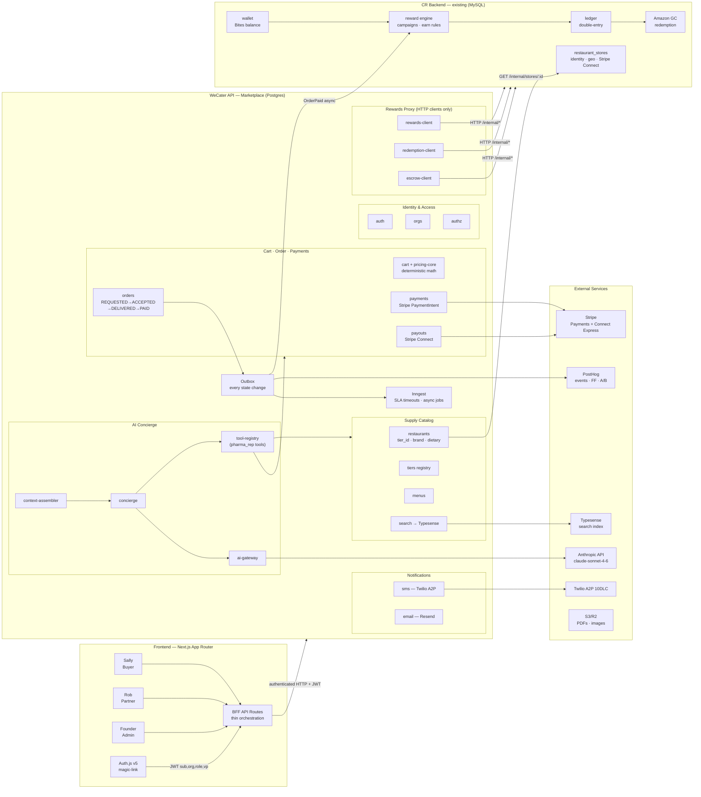
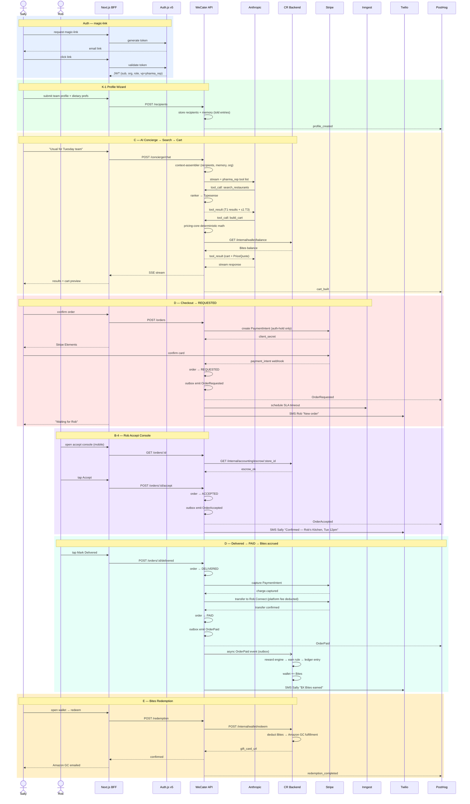

# WeCater — HLD (Realigned to Requirements + Inferences)

## Context

Prior plan (`marketplace-architecture-lld-hld.md`) was architecturally sound but diverged from `INFERENCES.md` on several axes: wrong seed vertical (corporate_ea vs pharma_rep), wrong tools (GrowthBook/ClickHouse vs PostHog, MSG91 vs Twilio, Keycloak vs Auth.js), deferred Rob portal that INFERENCES makes critical path, wrong order state machine (6-state vs 4-state), and no mention of Inngest.

**Goal:** MVP is non-throwaway production code. Every module, registry, and event boundary supports the full vision; MVP just ships a subset of packs, routes, and adapters. Adding a new vertical / tier / promotion rule / redemption route / ingestion adapter = data/config work only — no service edits.

Sources: `INFERENCES.md` (authoritative for MVP constraints) + `marketplace-architecture-lld-hld.md` (authoritative for full vision + LLD patterns).

---

## Part 1 — System Context

**Actors:**
- **Sally** (pharma rep, Phoenix) — buyer
- **Rob** (restaurant owner) — supply partner
- **Founder / Ops** — admin

**Owned services:** WeCater Next.js app, WeCater API (new marketplace), CR Backend (existing CateringRewards).

**External services:** Stripe (payments + Connect Express), PostHog (analytics + feature flags + A/B), Twilio (SMS), Resend/Postmark (transactional email), SendGrid (bulk outreach), Anthropic (AI), Typesense (search), Inngest (background jobs), S3/R2 (storage), Amazon GC API (redemption).

---

## Part 2 — Service Boundary

### Principle: minimum outsourcing, one source of truth per domain

Outsource to CR backend ONLY what already exists there and is the better owner. Everything else stays in marketplace.

```
┌─────────────────────────────────────────────────────┐
│  WeCater Marketplace — SOURCE OF TRUTH FOR:         │
│                                                     │
│  • Menu / MenuItem / ModifierGroup / ModifierOption │
│  • Cart / CartDraft / CartLine / PriceQuote         │
│  • Orders (REQUESTED→ACCEPTED→DELIVERED→PAID         │
│    + CANCELLED, REJECTED, ESCALATED, CAPTURE_FAILED) │
│  • Tier system (T1 / T3 capability flags)           │
│  • Synthesis pipeline + ingestion (T1 listings,     │
│    T3 public catalog, synthesis mode T1/T3)         │
│  • Recipients (team profiles / dietary memory)      │
│  • Organizations / OrganizationMembers              │
│  • VerticalPack registry                            │
│  • Concierge / AI (chat threads, tools)             │
│  • Quote requests / Restaurant leads                │
│  • Partner onboarding (Rob flow)                    │
│  • Notifications dispatch (Twilio, email, push)     │
│  • Founder ops console                              │
│  • Analytics event emission (PostHog)               │
│                                                     │
│  Marketplace DB: Postgres (own schema, own conn)    │
└────────────────────┬────────────────────────────────┘
                     │ HTTP calls — minimum surface
                     │ /internal/{rewards,wallet,
                     │  accounting,stores}/*
                     ▼
┌─────────────────────────────────────────────────────┐
│  CR Backend — SOURCE OF TRUTH FOR:                  │
│                                                     │
│  • Reward engine (campaigns, Bites earn rules,      │
│    incentive programs, promotion evaluation)        │
│  • Wallet + Bites/points (balance, transactions,    │
│    earn/redeem lifecycle, Amazon GC redemption)     │
│  • Accounting (double-entry ledger, journal         │
│    entries, reconciliation)                         │
│  • Rob's Bites wallet (recharge, auto-recharge,     │
│    deduction on OrderPaid — fully CR-owned)         │
│  • Stores (restaurant_stores — identity, geo,       │
│    Stripe Connect identity, billing relationship    │
│    with WeCater platform)                           │
│                                                     │
│  CR DB: MySQL (existing schema, existing conn)      │
└─────────────────────────────────────────────────────┘
```

### Cross-service communication

Two patterns — sync HTTP for reads, async event for writes that trigger CR-side logic.

**Sync HTTP calls (Marketplace → CR):**

| Call | When |
|------|------|
| `POST /internal/stores` | Rob onboarding — create restaurant identity record |
| `GET /internal/stores/:id` | Marketplace needs identity fields (name, address, geo, **Stripe Connect account_id for payouts**) |
| `GET /internal/wallet/balance` | Sally cart preview, wallet page (short-TTL Redis cache, 60s TTL) |
| `POST /internal/wallet/redeem` | Sally redeems Bites |

**Service-to-service auth (MP → CR):** Bearer token with HMAC-signed service JWT, shared secret per environment. LLD defines rotation and verification. No MP→CR call without this header — enforced at CR middleware.

**Async events (Marketplace emits → CR consumes):**

| Event | Payload | CR action |
|-------|---------|-----------|
| `OrderPaid` | `{marketplace_order_id, account_id, store_id, subtotal, earn_rate, platform_fee, is_first_order}` | Run reward engine → deduct from Rob's CR wallet (auto-recharge if low) → credit Sally's wallet → write ledger entry → store `(marketplace_order_id, ledger_entry_id)` for audit |

No other cross-service calls. Marketplace never reads CR DB directly. CR backend never calls marketplace.

### What CR backend does NOT know about

CR backend has no awareness of: order lifecycle states (REQUESTED/ACCEPTED/DELIVERED/ESCALATED), tiers, menus, cart, recipients, VerticalPacks, synthesis pipeline, AI, quote requests, leads. It only sees `OrderPaid` — a point-in-time fact with enough context to calculate rewards. Existing CR backend orders (`restaurant_store_orders` — receipt-based cashback, ezCater ingestion) continue unchanged alongside this new event-driven path.

### Key data split example — restaurant

| Data | Owner | Lives in |
|------|-------|----------|
| Restaurant identity (name, address, phone, geo) | CR backend `restaurant_stores` | CR MySQL |
| Stripe Connect account ID | CR backend | CR MySQL |
| Tier (T1/T3), brand fields, `dietary_fit` | Marketplace `restaurants` module | Marketplace Postgres |
| Menu content | Marketplace `menus` module | Marketplace Postgres |
| Synthesis provenance per field | Marketplace `synthesis` module | Marketplace Postgres |

Marketplace stores `cr_store_id` FK pointing to CR backend's `restaurant_stores.id`. No join across DBs — marketplace calls CR `/internal/stores/:id` when it needs identity fields.

---

## Part 3 — Service Topology

```
[wecater.ai — Next.js App Router]
  ├── Auth.js v5 (magic-link — Sally + Rob + Founder)
  ├── Buyer / Partner / Admin UI
  ├── PostHog browser SDK
  └── API Routes (BFF — thin orchestration, no business logic)
          │
          │ JWT (marketplace token: sub, org, role, vp, token_type: 'buyer'|'partner')
          │ buyer token: org + role + vp. partner token: restaurant_id only.
          │ Tokens never mix — authz middleware rejects wrong token_type per route.
          │ Expiry: 24h. No sliding refresh in MVP. Re-auth via new magic-link.
          ▼
[WeCater API — Node.js/Express — NEW standalone service]
  ├── Postgres (WeCater marketplace DB)
  ├── Redis (session cache, short-TTL projections)
  ├── Typesense (search index — derived state, rebuildable)
  ├── Inngest (background jobs — SLA timeouts, async pipeline)
  ├── Stripe (PaymentIntent, Connect Express)
  ├── Twilio (SMS — A2P 10DLC)
  ├── Resend/Postmark (transactional email)
  ├── SendGrid (bulk outreach — domain warmup L-7)
  ├── Anthropic (AI concierge — streaming SSE)
  ├── S3/R2 (file storage — PDFs, images)
  └── PostHog (server-side events)
          │
          │ HTTP /internal/{rewards,wallet,accounting,stores}/*
          ▼
[CR Backend — existing Node.js/Express/MySQL — CateringRewards]
  ├── Reward engine (campaigns, Bites earn, incentive programs)
  ├── Wallet + Bites (points) — source of truth
  ├── Accounting / double-entry ledger
  ├── Stores (restaurant_stores) — source of truth
  └── Amazon GC redemption handler (production-ready)
```

### Planned first splits (when pain shows up)
1. `ai-orchestrator` — different scaling shape, longest tail latencies
2. `pdf-worker` — long-running async, must not share request thread pool with checkout
3. `analytics-events` — high write volume

Each split enabled by day-1 discipline: table-prefix namespacing + service-interface access + outbox on every state change.

---

## Part 4 — Module Map (WeCater API)

Module = own table namespace + service API + events emitted. No cross-module DB joins. Cross-module access through service interfaces only (enables future extraction).

### A. Identity & Access

| Module | Status | Notes |
|--------|--------|-------|
| `auth` | new | Auth.js token validation; magic-link token generation; account creation on first login |
| `orgs` | new | Organization + OrganizationMember. `organizations.vertical_pack_id` pins to pack. No buyer-side Team (group = Recipient) |
| `verticals` | new | VerticalPack registry — config files, not DB rows. **MVP seed: `pharma_rep`** (`complianceTracking: true`, no ruleset yet). Phase 2: `corporate_ea`, `law_firm`, `hospital_system` |
| `marketplace-authz` | new | Static role→actions map. Pack-contributed roles. `can(principal, action)` checked on every route + every concierge tool. Two tokens never mix: buyer token (org, role, vp) vs partner token (restaurant_id) |

### B. Supply / Catalog

| Module | Status | Notes |
|--------|--------|-------|
| `restaurants` | new | Marketplace restaurant record: `cr_store_id` (FK to CR backend), `tier_id`, brand fields, `dietary_fit`, `compliance_fit`. Identity fields (name, address, geo) read from CR backend via `GET /internal/stores/:id`. **No ezCater or prospecting fields on this table.** |
| `tiers` | new | Tier registry. T1: `orderable=true, has_menu=true, payouts_enabled=true`. T3: discovery only. Capability check = registry flag lookup, never `if (tier_id === 1)` |
| `menus` | new | Menu/MenuItem/ModifierGroup/ModifierOption. Tier 1 only. Versioned — old orders pin old version |
| `dietary` | new | DietaryTag registry. Supply-side tagging + demand-side matching |
| `ingestion` | new | IngestionAdapter interface. MVP: `manual_ops` adapter. Phase 2: Yelp, Toast, MonkeyMedia, ezCater (prospecting only + separate DB) |
| `ezcater-gate` | new | **Code-level enforcement via data model separation.** ezCater prospecting data lives in a separate `prospecting_restaurants` table in its own DB schema — completely distinct from `restaurants`. `tier_3_subsegment` (3a/3b) lives in `prospecting_restaurants` only. User-facing modules (`restaurants`, `search`, `synthesis`) import from `restaurants` schema only — never `prospecting`. LLD defines compile-time type segregation to enforce this. No ezCater data in API responses, ever. |

### C. Search + Optimizer

| Module | Status | Notes |
|--------|--------|-------|
| `search` | new | Typesense wrapper. Index fed by outbox events from catalog. SQL fallback for MVP bootstrap |
| `ranker` | new | OptimizerMode registry + scoring. MVP seed: `smart` mode. Phase 2: MaxBites, MaxDiscount, Speed, Compliance. Math in code only — LLM writes rationale prose |
| `surfacing` | new | L-4 chatbot surfacing rules: T1 priority always, max 1 T3 per response, urgency routing (<24hr → phone CTA, >24hr → email quote) |

### D. CRM / Memory (Epic K)

| Module | Status | Notes |
|--------|--------|-------|
| `recipients` | new | Team profile. `(organization_id, owner_account_id)`. VisibilityMode from VerticalPack: `owner_only` for pharma_rep (personal territory). **K-1 wizard critical path — upstream of all AI quality** |
| `memory` | new | Dietary memory engine (K-2). `(subject, predicate, object, source: told\|learned, confidence)`. MVP: told entries from profile wizard. `memoryPredicates[]` gated by VerticalPack |
| `notes` | new | Free-text notes on recipients. Pinned/priority |
| `learning` | **Phase 2 — stub only in MVP** | Background workers: consume `OrderPaid` → emit learned Memory entries. Outbox emits `OrderPaid` from Day 1; workers attach in Phase 2 without producer change. No `OrderSettled` state exists — `OrderPaid` is terminal. |

### E. Cart & Order (Epics C, D)

| Module | Status | Notes |
|--------|--------|-------|
| `occasions` | new | MealOccasion — parent of parallel CartDrafts for one meal. Placing an order flips occasion to `ordered`, archives sibling drafts |
| `cart` | new | CartDraft + CartLine + perPersonOverrides[]. NL-edit deferred (structured tool calls cover MVP) |
| `pricing` | new | PriceQuote (server of truth) + PriceComponent typed lines. `pricing-core` shared client/server — instant previews client-side, server is canonical. Quote debounced ~300ms after edit stop, pinned to Order on submit |
| `orders` | new | **State machine: REQUESTED → ACCEPTED → DELIVERED → PAID + ESCALATED.** Outbox event on every transition even if no consumer in MVP |
| `promotions` | extend | Wraps existing campaigns engine in CR backend. `applied_promotions[]` in every PriceQuote |

**Order state machine detail:**
```
REQUESTED (auth-hold placed)
   ├── Rob accepts → ACCEPTED
   ├── Rob declines → REJECTED (terminal) → auth-void → Sally notified
   ├── Sally cancels → CANCELLED (terminal) → auth-void → done
   └── SLA timeout (Inngest) → ESCALATED
              │
         ACCEPTED
   ├── Rob marks delivered → DELIVERED
   ├── Sally cancels pre-delivery → CANCELLED (terminal) → auth-void
   └── No delivery update within window (Inngest) → ESCALATED
              │
         DELIVERED
   ├── Stripe capture succeeds → transfer to Rob Connect → PAID
   └── Stripe capture fails → CAPTURE_FAILED → Founder alert → manual retry or CANCELLED
              │
         PAID (terminal)
         outbox emits OrderPaid → CR backend async (reward engine → ledger → wallet)
         Sally SMS "$X Bites earned" fires on PAID, not DELIVERED

   ESCALATED (non-terminal)
   ├── Founder force-transitions → ACCEPTED (retry) or CANCELLED
   └── No auto-exit — Founder action required

   CANCELLED (terminal) — auth-void issued. No Bites. Outbox emits OrderCancelled.
   REJECTED (terminal) — auth-void issued. No Bites. Sally notified via SMS.
   CAPTURE_FAILED — Founder retries capture or issues CANCELLED + manual Rob compensation
```
Auth-hold captured ONLY on DELIVERED. Never before.

**⚠ Auth-hold expiry risk:** Stripe holds expire ~7 days. Must resolve before launch:
- Option A: restrict maximum advance booking window to <7 days in MVP
- Option B: Inngest job monitors expiry → re-authorizes before expiry (complex)
- Decide with Preet before building payment capture

### F. Payments + Payouts (Epics B, D)

| Module | Status | Notes |
|--------|--------|-------|
| `payments` | new | Stripe PaymentIntent (auth-hold at REQUESTED). Customer payment methods |
| `payouts` | new | **B-2 Stripe Connect Express — ⚠ Week 1 spike.** Bank verification edge cases real. Capture on DELIVERED → `application_fee_amount` = WeCater platform fee only → transfer remainder to Rob's Connect Express. Bites obligation NOT deducted here — CR backend handles from Rob's CR wallet. |

### G. Rewards / Bites (Epic E)

Rewards logic lives in CR backend. Marketplace calls CR backend HTTP API — does not implement earn/redeem logic itself.

| Marketplace module | Purpose | CR backend call |
|-------------------|---------|-----------------|
| `rewards-client` | On PAID: emit `OrderPaid` event (CR backend consumes asynchronously). Read Sally's wallet balance for cart preview / wallet page | Emit event via outbox; `GET /internal/wallet/balance` (sync read) |
| `redemption-client` | Sally redeems Bites via amazon route | `POST /internal/wallet/redeem` |

**Marketplace owns:** copy, UX, Bites earn display in cart/checkout. **CR backend owns:** all earn/redeem logic, Rob's wallet (recharge + auto-recharge), ledger entries, Sally's wallet balance, Amazon GC fulfillment. MP never touches Rob's wallet — CR handles deduction from Rob on `OrderPaid` event.

**Parallel workstream:** CR team exposes `/internal/{rewards,wallet,accounting,stores}/*` surface. Marketplace MVP Bites flow blocked until this ships. Can soft-launch without Bites if needed (feature flag).

**Copy enforcement (K-3):** "Bites" not "cashback" everywhere. IRS Announcement 2002-18 — rebate not income. `complianceTracking: boolean` on pharma_rep pack gates pharma-specific UX.

### H. AI Concierge (Epics C, K)

| Module | Status | Notes |
|--------|--------|-------|
| `ai-gateway` | new | Anthropic SDK wrapper. Model-agnostic (swap to OpenAI by config). Rate limits, cost telemetry, circuit breaker. Streaming SSE to BFF |
| `concierge` | new | ChatThread + ChatMessage. Thread anchored to MealOccasion. Orchestration loop: model → tool calls → tool results → model |
| `tool-registry` | new | Typed tools filtered by VerticalPack's `aiTools[]`. Every tool: `assertCan(principal, requiredAction)` before `exec`. Math never in LLM — tools call deterministic service methods |
| `context-assembler` | new | OrderContext computed on demand. Never persisted. Returns null for deferred modules (compliance, memory.learned) |

**MVP tools for `pharma_rep` pack:**
1. `open_recipient_profile` — loads team profile + dietary memory
2. `search_restaurants` — ranker query
3. `build_cart` — AI cart from menu + constraints (deterministic math, LLM writes item summary prose)
4. `estimate_bites` — calls pricing-core, not LLM
5. `place_order` — checkout flow
6. `request_quote` — T3 quote-request + email
7. `redeem_bites` — wallet redemption

**Deferred:** `edit_cart_nl` (NL-edit interpreter), compliance-attribution tools (Phase 2 with CMS Open Payments ruleset)

### I. Tier 3 Supply Funnel (Epic L)

| Module | Status | Notes |
|--------|--------|-------|
| `synthesis` | new | **L-1 one pipeline, two output modes.** Same input sources → `mode: tier1\|tier3` flag → different output contracts. T1: assertive, pending Rob approval → L-2 validator. T3: tentative framing, public display. **Source provenance stored as column per field** — not JSON blob. Validator checks "may offer / reportedly serves" framing post-generation (not just prompt instructions — LLMs drift) |
| `validator-ui` | new | L-2 internal validator UI: source provenance visible, checklist (prices match, dietary tags accurate, no ezCater-branded items, no 86'd items, no verbatim ezCater copy). Go/no-go gate before T1 goes live |
| `quotes` | new | QuoteRequest (server-side PDF via S3), QuoteReply. Structured outreach email (Sally's order context + WeCater intro + Rob sign-up CTA) |
| `leads` | new | RestaurantLead: `discovered → contacted → engaged → quote_received → activating → activated → tier1`. Signal score from QuoteRequest history |
| `outreach` | new | L-5 Rob heads-up email (3a: no ezCater mention, 3b: acknowledges relationship). L-6 Sally quote-request. **L-7 shared sending infra** — dedicated domain, SPF/DKIM/DMARC, CAN-SPAM. **Domain warmup = Week 3 minimum — start early** |
| `phone-reveal` | new | L-9 phone reveal + tap-to-call + dual-channel modal. tap-to-call event tracked regardless of email decision |
| `t3-to-t1` | new | L-12/13 tier transition. Rob shares ezCater URL → timestamped recorded consent → `tier_state: tier3 → tier1_draft` (logged, not overwritten) → live synthesis (Rob watches) → L-2 validator |
| `86d-detector` | new | L-14 runs before L-2: item on ezCater absent on own-site → flagged. Brand blocklist + LLM classifier detect "ezBox" etc. Must complete before validator UI — Rob must never see unfiltered ezCater content |

### J. Rob Portal (Epic B)

| Module | Status | Notes |
|--------|--------|-------|
| `partner-auth` | new | Separate token namespace from buyer. SMS + email magic-link invite |
| `onboarding` | new | **B-6 e-sign participation agreement — ⚠ load-bearing legally.** Timestamp + record consent moment. This is what makes ezCater URL pull (L-12) legally defensible |
| `stripe-connect` | new | **B-2 — ⚠ Week 1 spike.** Bank verification + identity checks have real edge cases. Nothing else matters until this is resolved |
| `settings` | new | B-3: cashback% OR discount% (not both — D8 decision pending Week 2), lead time, delivery radius, hours, accepting toggle |
| `accept-console` | new | **B-4 mobile-first.** Rob in kitchen / on road. SMS + browser push on new order. Accept/reject. SLA window timer visible |

**Rob onboarding store creation flow:**
```
Founder triggers invite
Rob completes onboarding form
Marketplace calls CR backend POST /internal/stores → cr_store_id returned
Marketplace creates own restaurants row (cr_store_id, tier_id=T3, brand_fields...)
Rob completes Stripe Connect via CR backend (it owns billing relationship)
Rob completes settings → sets earn_rate% + configures CR wallet auto-recharge → accepting=true (no escrow gate — CR auto-recharge covers Bites obligation per order)
Synthesis pipeline runs → marketplace menus/catalog rows created
Rob reviews listing → L-2 validator → Tier 1 live
```

### K. Notifications (Epic F)

| Module | Status | Notes |
|--------|--------|-------|
| `sms` | new | Twilio A2P 10DLC. **⚠ Register Week 0 — approval takes time. Toll-free fallback if delayed.** |
| `email` | new | Resend/Postmark transactional. **Triage candidate — cut to SMS-only if behind Week 4** |
| `templates` | new | Versioned, vertical-aware copy. pharma_rep pack gets pharma-specific copy variants |

**Notification map:**

| Event | Sally | Rob | Founder |
|-------|-------|-----|---------|
| REQUESTED | — | SMS + browser push | — |
| ACCEPTED | SMS "Confirmed — [Restaurant], [time]" | — | — |
| DELIVERED | SMS "Order delivered — Bites arriving shortly" | — | — |
| PAID | SMS "$X Bites earned" (fires after Stripe capture, Bites accrue async in CR) | — | — |
| REJECTED | SMS "Rob declined — [reason]. Try another restaurant?" | — | — |
| CANCELLED | SMS "Order cancelled. Auth-hold released." | — | — |
| CAPTURE_FAILED | — | — | Slack + email alert |
| ESCALATED | — | — | Slack + email |

Note: Bites SMS on PAID uses estimated amount from PriceQuote (`estimate_bites` tool). Actual Bites written by CR async — if CR earn differs, CR-side notification is Phase 2.

### L. Founder Ops Console (Epic G)

| Module | Status | Notes |
|--------|--------|-------|
| `admin` | new | Order management (view by state, force transitions, ESCALATED queue). Restaurant list/detail. Sally list/detail. G-4 alerting (Slack/email) on ESCALATED, Rob no-show, zero orders Week 6-7, Sentry spike. **Not in scope:** self-serve disputes, automated refunds, multi-admin roles |

### M. Analytics (Epic J)

PostHog as single tool for events + feature flags + A/B.

**J-1 Event taxonomy (fire from Day 1):**
- Sally: signup, profile_created, prompt_submitted, results_viewed, cart_built, checkout_completed
- Orders: REQUESTED, ACCEPTED, DELIVERED, PAID, ESCALATED
- Rewards: bites_earned, wallet_opened, redemption_completed
- Tier 3: card_viewed, email_sent, phone_tapped, variant_tagged

**J-2 Funnel dashboards (pre-built for Monday review):**
- Sally signup → first order (target ≥30%)
- Tier 3 card view → action rate
- Tier 3 inquiry → Tier 1 conversion

**J-3 A/B experiment — Tier 3 card depth:**
- `hash(user_id) % 2` → variant. **User-scoped, not session-scoped.** Persists across devices.
- PostHog feature flag controls 3d-minimal (A) vs 3d-enhanced (B) variant
- Tier 3 visibility itself also controlled by PostHog FF — toggle without deploy

---

## Part 5 — Communication Patterns

### Sync
- Auth.js (Next.js) issues JWT → WeCater API validates
- Next.js BFF → WeCater API: authenticated HTTP
- WeCater API → Stripe: payment operations
- WeCater API → CR Backend `/internal/loyalty/*`: wallet reads (balance for cart preview), ledger writes (earn on PAID)
- WeCater API → Typesense: search queries

### Async — Inngest jobs (Epic D-2)
- Accept SLA timeout → ESCALATED (configurable window)
- Auth-hold expiry monitoring
- Delivery reminder to Rob
- Async image population + 86'd detection post-onboarding (L-14)
- Cron scrapers — Phase 2 (A-1, A-2)

### Async — Outbox events (marketplace emits, CR backend and internal consumers subscribe)

Every state-changing module emits to outbox even if no consumer subscribes in MVP.

| Event | Producer | Consumers |
|-------|----------|-----------|
| `OrderPaid` | `orders` module | **CR backend** (reward engine → ledger → wallet), PostHog, learning workers (Phase 2) |
| `OrderRequested` | `orders` module | PostHog, Inngest (SLA timer start) |
| `OrderAccepted` | `orders` module | PostHog, notifications |
| `OrderDelivered` | `orders` module | PostHog, payments (capture trigger) |
| `OrderEscalated` | `orders` module | PostHog, admin alerting |
| `RestaurantActivated` | `restaurants` module | search-index sync, PostHog |
| `CatalogUpdated` | `menus` module | search-index sync |

Pattern: `(id, type, version, occurred_at, payload)`. All consumers idempotent — dedupe by event `id`.

---

## Part 6 — Data Ownership

| Data | Source of Truth | Lives in | Access pattern |
|------|----------------|----------|----------------|
| Restaurant identity, geo, Stripe Connect | CR Backend `restaurant_stores` | CR MySQL | Marketplace calls `GET /internal/stores/:id` |
| Restaurant tier, brand, dietary_fit | Marketplace `restaurants` | MP Postgres | Direct read |
| Menu / MenuItem / Modifiers | Marketplace `menus` | MP Postgres | Direct read — marketplace SOT |
| CartDraft, CartLine, PriceQuote | Marketplace `cart+pricing` | MP Postgres | Direct read |
| Order, full lifecycle state machine | Marketplace `orders` | MP Postgres | Direct read — marketplace SOT |
| Bites wallet balance | CR Backend `wallet` | CR MySQL | `GET /internal/wallet/balance` |
| Bites accrual (earn on PAID) | CR Backend `reward engine + ledger` | CR MySQL | MP emits `OrderPaid` event → CR consumes → deducts Rob's CR wallet → credits Sally's wallet → writes ledger |
| Rob's Bites wallet (recharge + auto-recharge) | CR Backend `accounting` | CR MySQL | CR-owned entirely. MP never reads or writes. Auto-recharge fires when low. |
| Recipients, Memory | Marketplace `recipients+memory` | MP Postgres | Direct read |
| Organization, OrganizationMember | Marketplace `orgs` | MP Postgres | Direct read |
| Restaurant leads, quote requests | Marketplace `leads+quotes` | MP Postgres | Direct read |
| PostHog events | PostHog (analytics only) | PostHog cloud | Never source of truth for business logic |
| Search index | Typesense | Typesense | Derived — rebuildable from MP Postgres |
| PDFs (quote requests) | S3/R2 | Object store | Blob reference stored in MP Postgres |

---

## Part 7 — Frontend Structure

```
apps/
  buyer/          ← Sally: profiles, chat/concierge, optimizer, cart, wallet
  partner/        ← Rob: onboarding, accept console, settings, listing review
  admin/          ← Founder: order ops, lead pipeline, alerts

packages/
  ui/             ← design tokens + primitives (extracted from current demo atoms.tsx)
  pricing-core/   ← deterministic Bites + price math (shared client/server)
  types/          ← canonical TS types for all WeCater entities
  ai-tools/       ← typed tool definitions (imported by concierge + buyer UI)
```

The current demo (`wecater-demo-full`) is the `buyer/` app prototype. Components (ChatConcierge, CartBuilder, BitesWallet, Optimizer, ProfileManager) migrate to `apps/buyer/` with live data wired in.

---

## Part 8 — MVP / Phase 2 Boundary

### Ships in MVP (~8 weeks)

| Epic | Scope |
|------|-------|
| B — Rob Portal | Full: onboarding, Stripe Connect, settings, accept console, listing approval |
| C — Sally Experience | Full: magic-link, team profile wizard, NL search, cart, T1 checkout, order status |
| D — Order Lifecycle | Full: state machine, Inngest jobs, Stripe capture |
| E — Rewards | Earn + Amazon redemption. Pre-funded escrow. IRS-compliant copy |
| F — Notifications | SMS primary (Twilio). Email triage candidate |
| G — Founder Ops | Order mgmt, restaurant/Sally views, alerting |
| H — ACP Feed | Triage candidate #1 — cut first if behind |
| J — Analytics | PostHog from Day 1. All events. Funnel dashboards. A/B framework |
| K — Concierge | K-1 team profile wizard, K-2 dietary memory, K-3 Bites UX copy |
| L — Tier 3 / Pipeline | Full except L-8 (sales rep dashboard) |

### Deferred to Phase 2+

| Area | Why safe to defer |
|------|-------------------|
| Tier 2 (Olo/Toast/MonkeyMedia) | INFERENCES: Phase 2 only |
| CMS Open Payments compliance ruleset | `complianceTracking` flag ships as placeholder. Ruleset = config addition |
| `wecater_credit` + `restaurant_boost` routes | Registry seam ships. Handler = code addition |
| Multi-org switching UX | One org per session covers MVP |
| Additional VerticalPacks | `pharma_rep` validates registry. Adding pack = one config file |
| Analytics warehouse (ClickHouse/BigQuery) | PostHog handles MVP. Warehouse if PostHog not enough |
| NL-edit cart interpreter | Structured tools cover e2e |
| InboundMail parser (quote replies) | Ops enters manually via admin |
| Native mobile app | PWA first |
| Learning workers (told→learned memory) | Outbox events fire; workers attach later |

---

## Part 9 — Architecture Guardrails (Non-negotiable)

1. **Math in code, never LLM.** Bites earn, cart pricing, redemption value — deterministic code. LLM writes prose only.
2. **Tier capability = registry flag lookup.** Never `if (tier_id === 1)`.
3. **No `if (pack === 'pharma_rep')`.** Pack-aware behavior reads VerticalPack at runtime.
4. **ezCater data never reaches user-facing product.** Enforced by data model: `prospecting_restaurants` in separate DB schema, never imported by user-facing modules. `restaurants` table has no ezCater fields.
5. **Stripe auth-hold captured ONLY on DELIVERED.**
6. **Rob's Bites obligation settled by CR backend from Rob's CR wallet.** Auto-recharge handles shortfalls. MP never deducts Bites from Stripe payout — `application_fee_amount` = platform fee only. MP never reads or writes Rob's CR wallet.
7. **Bites = rebate not income.** "Bites" everywhere, never "cashback". IRS Announcement 2002-18.
8. **A/B variant user-scoped.** `hash(user_id) % 2`. Never session/cookie-scoped.
9. **PostHog from Day 1.** Every hypothesis measurable. No data = no Phase 2 decisions.
10. **Outbox on every state change.** At-least-once delivery. All consumers idempotent by event `id`. Per-order partition key ensures ordering within an order's event stream. LLD defines relay and DLQ.
11. **Source provenance per field** in synthesis pipeline. Column, not JSON blob. Legal defensibility.
12. **Participation agreement timestamped.** Not a checkbox. Required before ezCater URL pull.
13. **PostHog feature flags fail closed.** T3 visibility off = hidden. Tier 3 must never be shown if flag evaluation fails. Analytics events queue locally and flush on recovery — never block the request path.
14. **Stripe webhooks idempotent.** All Stripe webhook handlers dedupe by `event.id`. Retries safe.
15. **Structured logging + distributed tracing from Day 1.** Every MP→CR HTTP call and outbox relay carries a trace ID. No silent failures. LLD defines exporters (OpenTelemetry).
16. **JWT carries `token_type`.** `buyer` tokens rejected at partner routes and vice versa. Enforced at authz middleware, not per-route code.

---

## Part 10 — Critical Path + Risks

| Risk | Severity | Resolution |
|------|----------|------------|
| ⚠ B-2 Stripe Connect Express | P0 | Spike Week 1. Bank verification edge cases. Nothing ships to Rob without this |
| ⚠ A2P 10DLC Twilio registration | P0 | Founder action Week 0. Engineering unblocked on SMS only after approval |
| ⚠ Auth-hold expiry (7-day Stripe limit) | P0 | Decide: restrict advance booking window OR build re-auth Inngest job. Raise with Preet before D-3 |
| ⚠ CAPTURE_FAILED has no automated resolution | P0 | Manual Founder path only in MVP. Define SLA for Founder response and Rob compensation protocol before launch |
| ⚠ CR backend `/internal/*` surface | P1 | Parallel CR workstream. Must expose wallet balance read + redeem + `OrderPaid` consumer. Soft-launch with feature flag if delayed. |
| ⚠ Stripe Connect webhook handler | P1 | `account.updated`, `capability.updated`, `payout.failed` must be handled by `stripe-connect` module. Unhandled = Rob silently loses payout capability |
| ⚠ Outbox relay implementation | P1 | At-least-once delivery with per-order ordering is non-trivial. Must be agreed and designed at LLD before any module ships state transitions |
| ⚠ Domain warmup (L-7 outreach) | P1 | Start Week 3. Late = L-5/L-6 in spam folders |
| ⚠ Team profile completion (K-1) | P1 | Profile ≥70% completion = AI quality gate. D9 decision (required vs skippable) by end Week 2 |
| ⚠ B-6 participation agreement | P1 | Timestamp + record. This is what makes L-12 ezCater URL pull legally defensible |
| ⚠ PostHog as single FF + analytics system | P1 | All FF reads must have hardcoded safe defaults. FF fail-closed enforced. Analytics loss for short outages acceptable. |

---

## Part 11 — Failure Mode Decisions

HLD-level decisions on degraded behavior. Implementation detail (retry intervals, DLQ config) deferred to LLD.

| Failure | Behavior | Rationale |
|---------|----------|-----------|
| CR `/internal/wallet/balance` down at cart preview | Show cached Bites balance (Redis, 60s TTL). Cache miss → show "Bites unavailable" banner. Cart still usable. | Cart must not block on CR availability |
| CR `OrderPaid` consume fails / Rob wallet deduction fails | CR retries via its own DLQ. Auto-recharge fires if wallet low. MP has no visibility into CR wallet state. MVP: Founder monitors CR health separately. Phase 2: CR emits `RewardFailed` event → Founder alert. | CR owns its own retry and wallet — MP cannot compensate |
| Anthropic unavailable (ai-gateway circuit open) | Fallback to search-only mode: structured search (Typesense) surfaced directly, no NL. Sally sees "AI concierge temporarily unavailable — search below." | AI is enhancement, not gate. Order flow must work without it. |
| Typesense down | Fall back to Postgres full-text search (pre-built query, not Typesense). Degraded ranking, no typo tolerance. | Search must always return results for T1 restaurants |
| PostHog FF fetch fails | Fail closed: T3 hidden, Tier 3 features off. Analytics events queued in-memory, flushed on recovery. | Showing T3 without FF context = legal risk (ezCater data leakage path) |
| Stripe capture fails (DELIVERED → CAPTURE_FAILED) | Order enters CAPTURE_FAILED. Founder alerted via Slack + admin queue. Manual retry or CANCELLED + Rob compensation note. | No automated refund in MVP — Founder mediates |
| Stripe webhook duplicate / retry | Dedupe by Stripe `event.id` in outbox. Idempotent handlers. No side effects on replay. | Stripe retries for 3 days |
| Twilio SMS failure | Best-effort retry (Twilio handles). No blocking. Notification logged as failed in DB. Founder can see delivery failures in admin. | Notifications are not transactional — order state is ground truth |

---

## Part 12 — Divergences from Previous Plan

| Topic | Previous plan | This plan (aligned to INFERENCES) |
|-------|--------------|-----------------------------------|
| Seed VerticalPack | `corporate_ea` | `pharma_rep` (Sally is pharma rep — MVP persona) |
| Feature flags | GrowthBook | PostHog (unified analytics + FF + A/B) |
| Analytics warehouse | ClickHouse / BigQuery | PostHog for MVP; warehouse Phase 2 if needed |
| SMS provider | MSG91 | Twilio A2P 10DLC |
| Auth | Keycloak SSO | Auth.js v5 magic-link |
| Background jobs | Custom outbox workers | Inngest |
| Rob portal in MVP | Deferred (admin-mediated T1) | **In MVP** (critical path per INFERENCES B) |
| Order state machine | `placed→accepted→in_kitchen→out_for_delivery→delivered→settled` | `REQUESTED→ACCEPTED→DELIVERED→PAID` + ESCALATED |
| AI streaming | Not specified | SSE from concierge endpoint |
| Bites framing | Generic | IRS rebate framing enforced — "Bites" not "cashback" |
| Concierge deferred | Partial (MVP has it, but NL-edit deferred) | Confirmed: 7 tools ship, NL-edit Phase 2 |

---

## Verification

End-to-end test of MVP:
1. Sally: magic-link → 30s team profile wizard → types "Usual for Tuesday team" → sees 3-5 results (T1 + max 1 T3) → picks T1 → AI builds cart → checkout (Stripe auth-hold) → order REQUESTED
2. Rob: receives SMS + browser push → opens accept console on phone → accepts within SLA → order ACCEPTED → Sally SMS "Confirmed"
3. [Delivery day] Rob marks delivered → DELIVERED → Stripe capture → transfer to Rob's Connect → Bites accrued → Sally SMS "$X earned"
4. Sally opens wallet → redeems → Amazon GC emailed
5. Founder ops: sees all orders by state, handles any ESCALATED queue
6. PostHog: every step above fires a trackable event, funnels visible in dashboard

---

## Part 14 — System Diagrams

### Architecture — Service Subgraphs



#### Subgraph breakdown

**`FE` — Frontend (Next.js App Router)**

All 3 actors hit one BFF (thin API routes, no business logic). Auth.js v5 issues JWT `(sub, org, role, vp)` — travels with every downstream request.

**`MP` — WeCater API (Marketplace, owns Postgres)**

6 inner subgraphs, module-namespaced tables in one Postgres DB:

| Inner subgraph | Responsibility |
|---|---|
| Identity & Access | auth (token validation), orgs (org + members), authz (role→action map, pack-aware) |
| Supply Catalog | restaurants row (tier_id, brand, dietary — NOT identity), tiers capability registry, menus, search (Typesense wrapper) |
| AI Concierge | context-assembler → concierge orchestration loop → tool-registry (filtered by pharma_rep pack) → ai-gateway (Anthropic SDK) |
| Cart · Order · Payments | cart + pricing-core (deterministic math, never LLM), orders state machine, payments (Stripe auth-hold), payouts (Stripe Connect transfer) |
| Rewards Proxy | HTTP clients only — no reward logic. rewards-client, redemption-client, escrow-client all proxy to CR backend `/internal/*` |
| Notifications | sms (Twilio), email (Resend) — dispatch only |

Plus two cross-cutting nodes: **Outbox** (emits on every state change, even with no consumer in MVP) and **Inngest** (SLA timeouts, async jobs).

**`CR` — CR Backend (existing, owns MySQL)**

Receives from Marketplace via two channels only:

| Channel | Calls |
|---|---|
| Sync HTTP | `GET /internal/stores/:id`, `GET /internal/wallet/balance`, escrow reads |
| Async event | `OrderPaid` from outbox → reward engine → ledger → wallet |

Never calls Marketplace. Never touches MP Postgres.

**`Ext` — External Services**

| Service | Caller | Purpose |
|---|---|---|
| Stripe | payments + payouts | auth-hold, capture, Connect transfer |
| Twilio | sms mod | A2P SMS to Sally + Rob |
| Anthropic | ai-gateway | LLM streaming |
| Typesense | search mod | derived index, rebuildable from MP Postgres |
| PostHog | outbox consumer | every event, feature flags, A/B |
| S3/R2 | quotes mod | PDF blob storage |

#### Key edges

| Edge | Type | Note |
|---|---|---|
| `outbox → engine_cr` | async | Only coupling point where MP triggers CR-side writes |
| `rewards_c/redeem_c/escrow_c → CR` | sync HTTP `/internal/*` | Thin surface, strictly bounded |
| `rest_mod → stores_cr` | sync HTTP | MP never stores name/address/geo — always fetches from CR |
| `conc → tools → Catalog & Commerce` | in-process | AI tools call deterministic service methods, never compute math |

---

### Happy Path — Full Sequence (Auth → Redemption)


